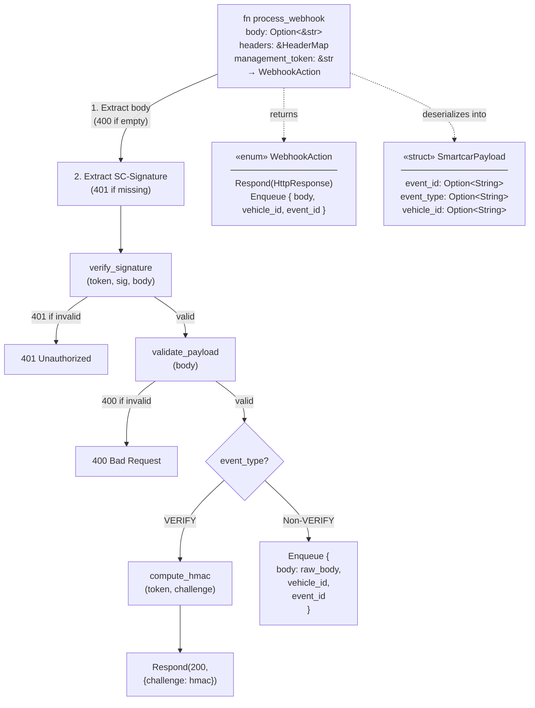
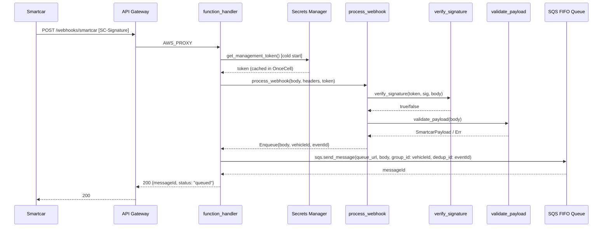
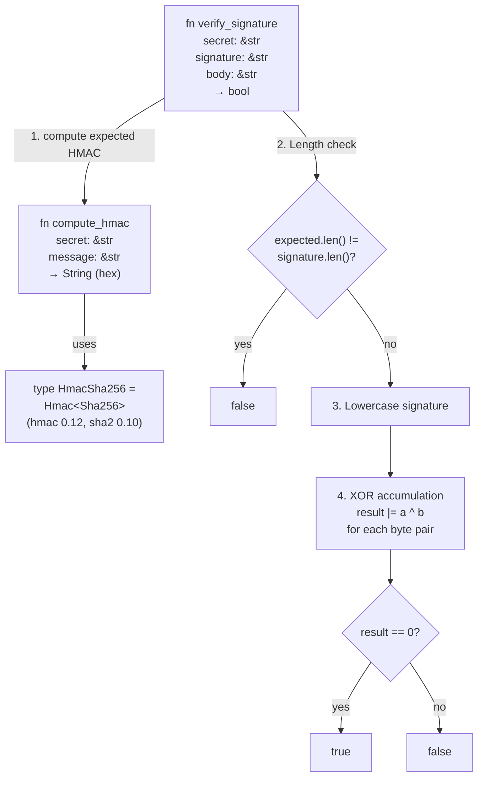
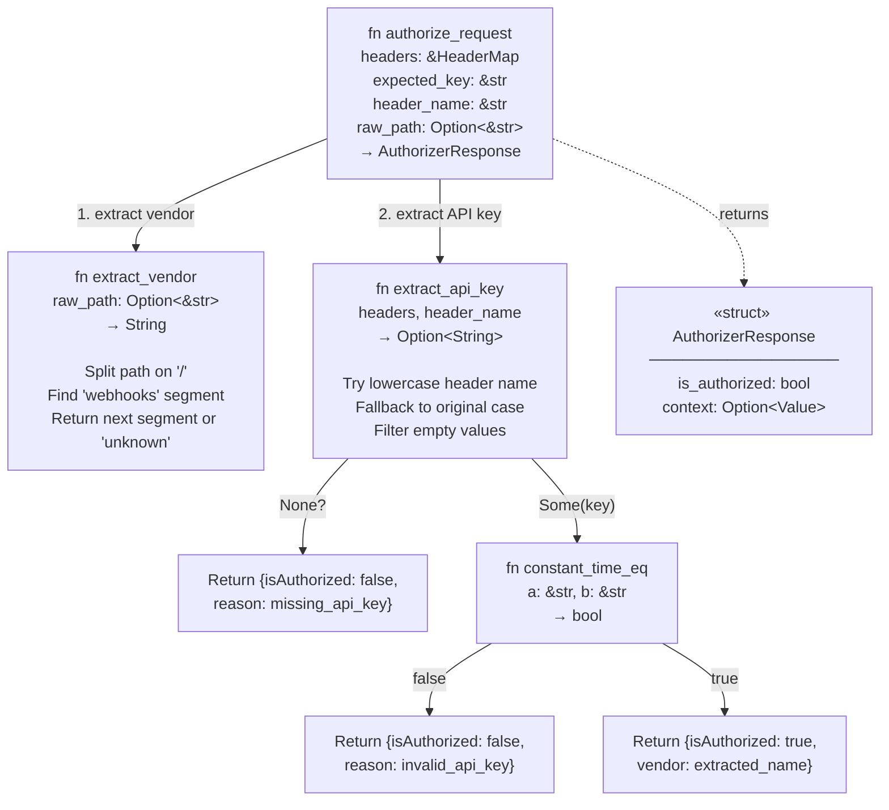
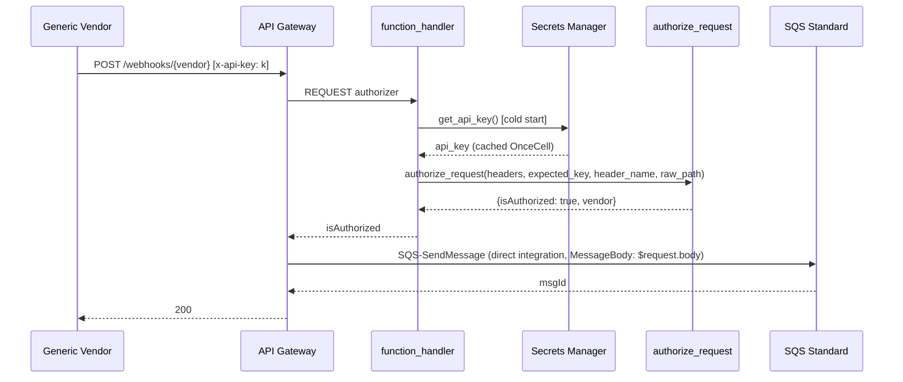
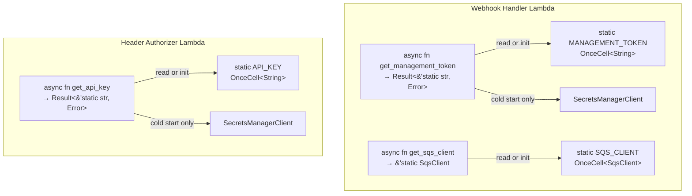

# Code Diagrams

This level zooms into the most architecturally significant components of the system. The selection focuses on: (1) the core webhook processing pipeline with its functional-core / imperative-shell pattern, (2) the HMAC-SHA256 signature verification that secures Path A, (3) the Header Authorizer's constant-time API key comparison, and (4) the `OnceCell`-based secret caching strategy shared across both Lambdas.

---

## 1. process_webhook -- Core Webhook Processing Pipeline

The `process_webhook` function in `authorizer/src/main.rs` is the central decision-maker for Path A. It is a pure function (no AWS SDK calls) that takes the raw HTTP request components and returns a `WebhookAction` enum, making it fully unit-testable.

### Code Diagram

### Sequence: Full Request Lifecycle (Path A)

### Analysis Lenses

**Code Analysis:**
- **Pattern:** Functional-core / imperative-shell. The `process_webhook` function is pure (no side effects, no AWS calls). The `function_handler` is the thin imperative shell that fetches secrets and executes SQS calls based on the returned `WebhookAction`.
- **Branching:** Five early-return paths (empty body, missing signature, invalid signature, invalid payload, VERIFY challenge) and one success path (Enqueue).
- **Input/Output types:** Takes `Option<&str>` body, `&HeaderMap` headers, `&str` token. Returns `WebhookAction` enum.

**Security:**
- HMAC-SHA256 verification using the `hmac` and `sha2` crates.
- Constant-time comparison via XOR accumulation (`result |= a ^ b`) to prevent timing side-channel attacks.
- Case-insensitive signature comparison (signature is lowercased before comparison).
- The management token never appears in logs or error responses.

**Error Handling:**
- Every failure path returns a specific HTTP error code (400 or 401) with a descriptive JSON error body.
- A `500` response is returned only if Secrets Manager or SQS fails (handled in `function_handler`).
- The `WebhookAction::Respond` variant allows the pure function to express error responses without raising exceptions.

---

## 2. verify_signature -- HMAC-SHA256 Constant-Time Verification

The `verify_signature` function in `authorizer/src/main.rs` is the security-critical gate for Path A. It computes the expected HMAC and compares it to the provided signature using constant-time logic.

### Code Diagram

### Analysis Lenses

**Security:**
- **Timing attack prevention:** The XOR accumulation pattern (`result |= a ^ b`) ensures comparison time is constant regardless of where a mismatch occurs. An attacker cannot infer correct signature bytes from response timing.
- **Length check:** Mismatched lengths are rejected immediately, which is safe because the expected HMAC length (64 hex chars) is not secret.
- **Case insensitivity:** The provided signature is lowercased before comparison, accommodating vendors that uppercase hex digits.
- **OWASP relevance:** Addresses OWASP A2:2021 (Cryptographic Failures) by using standard HMAC-SHA256 and A7:2021 (Identification and Authentication Failures) by rejecting missing/invalid signatures.

**Performance:**
- `compute_hmac` is O(n) in message length.
- Constant-time comparison is O(n) in signature length (always 64 bytes).
- No allocations beyond the hex encoding string.

---

## 3. authorize_request -- Header-Based API Key Authorization

The `authorize_request` function in `header-authorizer/src/main.rs` is the decision-maker for Path B. It extracts the API key, compares it, and returns a structured authorization response.

### Code Diagram

### Sequence: Path B Authorization Flow

### Analysis Lenses

**Security:**
- **Constant-time comparison:** Same XOR accumulation pattern as the HMAC verifier, preventing timing attacks on the API key.
- **Identity source isolation:** API Gateway is configured with `identitySource: ['$request.header.x-api-key']`, meaning the authorizer is only invoked when the header is present at the gateway level.
- **Vendor context:** The authorization response includes the vendor name in context, which API Gateway can forward to downstream integrations for audit logging.

**Data Flow:**
1. Raw HTTP request arrives at API Gateway with `x-api-key` header.
2. Gateway extracts the identity source and invokes the Lambda Authorizer.
3. Lambda fetches the expected key from Secrets Manager (cached after cold start).
4. `authorize_request` extracts the key from headers, vendor from path, compares keys.
5. Response: `{isAuthorized: true/false, context: {vendor: "...", reason: "..."}}`.
6. If authorized, API Gateway routes `$request.body` directly to SQS via `SQS-SendMessage` integration (Lambda never touches the payload body).

---

## 4. OnceCell Secret Caching Strategy

Both Lambdas use the same caching pattern: a `OnceCell<String>` static that is populated on the first invocation (cold start) and reused for all subsequent invocations within the same execution environment.

### Code Diagram

### Analysis Lenses

**Performance:**
- **Cold start cost:** One Secrets Manager API call (~50-100ms) per Lambda execution environment lifecycle. This is amortized across potentially thousands of warm invocations.
- **Warm path:** `OnceCell::get()` is a single atomic load, effectively zero overhead.
- **SQS client caching:** The Webhook Handler also caches the `SqsClient` in a `OnceCell`, avoiding repeated AWS config loading and client initialization.

**Error Handling:**
- If the Secrets Manager call fails on cold start, the Lambda returns a 500 error (Webhook Handler) or denies access (Header Authorizer) rather than crashing.
- The `OnceCell::set()` call returns `Err` if the cell is already initialized (race condition between concurrent cold starts), but the value is silently ignored since the first writer wins and the result is identical.
- Secret rotation requires a new Lambda execution environment (cold start) to pick up the new value. This is consistent with the Lambda execution model where rotation triggers a function configuration update.

**Data Flow:**
1. Lambda starts, `main()` initializes tracing and starts the runtime loop.
2. First invocation: `get_*()` calls `OnceCell::get()` -> returns `None` -> enters cold path.
3. Cold path: loads AWS default config, creates Secrets Manager client, fetches secret by `SECRET_NAME` env var, stores in `OnceCell`.
4. Returns `&'static str` reference to the cached value.
5. Subsequent invocations: `OnceCell::get()` returns `Some(&value)` immediately.
