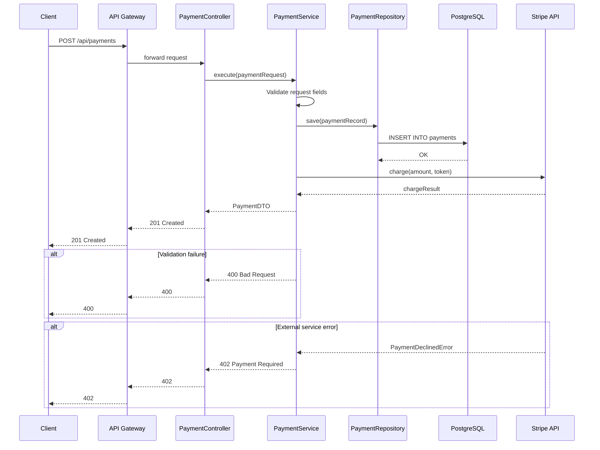

# doc-api

## Description
Generates API documentation: endpoint index, per-endpoint pages with Mermaid sequence diagrams, request/response schemas, and call graphs. Runs as Wave 2.

## Context
fork

## References
- ../references/mermaid-diagram-guide.md

## Instructions

### Inputs
1. Read `docs/.doc-plan.json` — verify `doc-api` is enabled
2. Read `docs/.doc-manifest.json` — get files under `doc-api.files`
3. Read assigned source files in batches of 5-8 to stay within context limits
4. Read prior Wave 1 output for system context (do not regenerate): `docs/md/arch-overview.md`, `docs/md/arch-c4-level1.md`, `docs/md/arch-c4-level2.md`. Use these to reference component names, system boundaries, and container relationships.
5. Read `mermaid-diagram-guide.md` from the shared references directory for Mermaid syntax

### Analysis Steps
1. **Discover endpoints** — scan controllers/routes for HTTP method annotations/calls (e.g. `@GetMapping`, `app.get()`, `@app.route()`, `http.HandleFunc()`). Extract: method, path, params, request/response types.
2. **Trace call chains** — for each endpoint follow controller -> service -> repository/DB -> external APIs -> events. Map the complete chain.
3. **Document request/response** — path params, query params, request body schema (from DTOs/models), response schema, error responses (from exception handlers), auth requirements.

### Output Files
All files go to `docs/md/`.

**`api-index.md`** — Frontmatter: title "API Endpoint Index", section "API Plane", order 1, generated "{{DATE}}". Content: summary table of ALL endpoints (Method | Path | Description | Auth Required) grouped by resource/domain. Link each row to its detail page.

**`api-{method}-{path-slug}.md`** (one per endpoint) — Naming: `POST /api/v1/payments` -> `api-post-payments.md`, `GET /api/v1/payments/{id}` -> `api-get-payments-id.md`. Frontmatter: title "{METHOD} {PATH}", section "API Plane", order N, generated "{{DATE}}". Sections: Overview, Authentication, Parameters (table), Request Body, Response, Error Responses, Sequence Diagram, Related Endpoints.

### Diagram Format — Mermaid Sequence Diagrams

Every endpoint gets a `sequenceDiagram` block showing the full request lifecycle:

**Arrow conventions:**
- `->>` solid arrow: synchronous request (caller waits)
- `-->>` dashed arrow: response / return value
- Use `alt`/`else` for error paths
- Use `opt` for optional flows (e.g., caching, idempotency)
- Use `Note over` for internal processing descriptions

### Rules
- EVERY endpoint must have a sequence diagram
- Parameter types must be specific (String, Long, UUID -- not "any")
- Response schemas must reflect actual DTO/model fields
- Error responses must reflect actual exception handling
- Use real class/method names from the codebase
- Cross-reference related endpoints
- For >20 endpoints, process in batches of ~5 grouped by resource; write index last

## Tools
- Read
- Glob
- Grep
- Write

## Output
Markdown files in `docs/md/`:
- `api-index.md`
- `api-{method}-{path-slug}.md` (one per endpoint)
