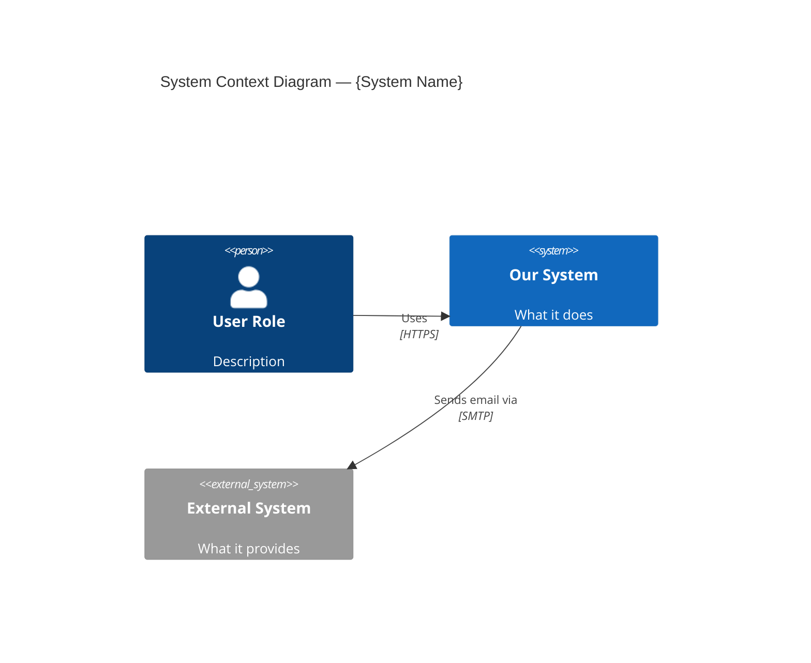
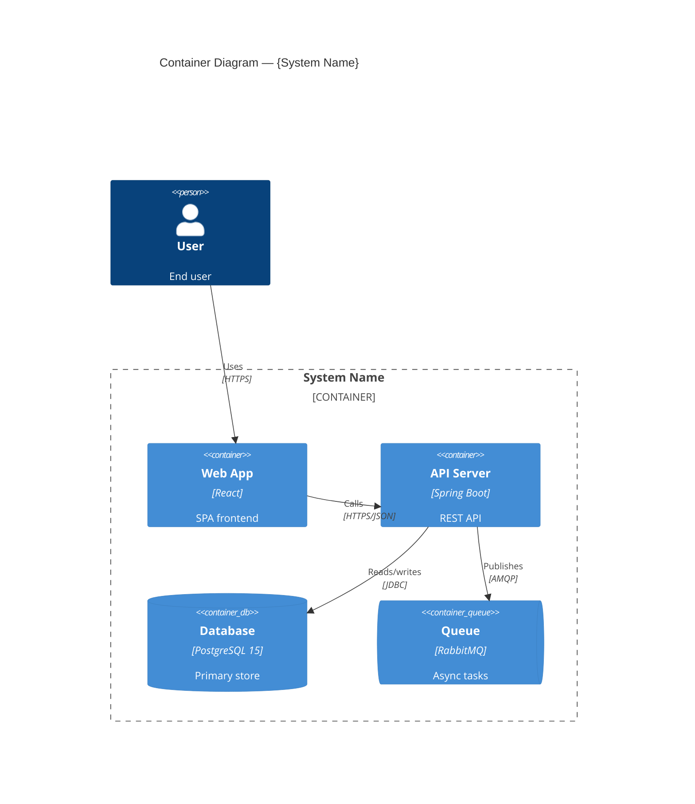
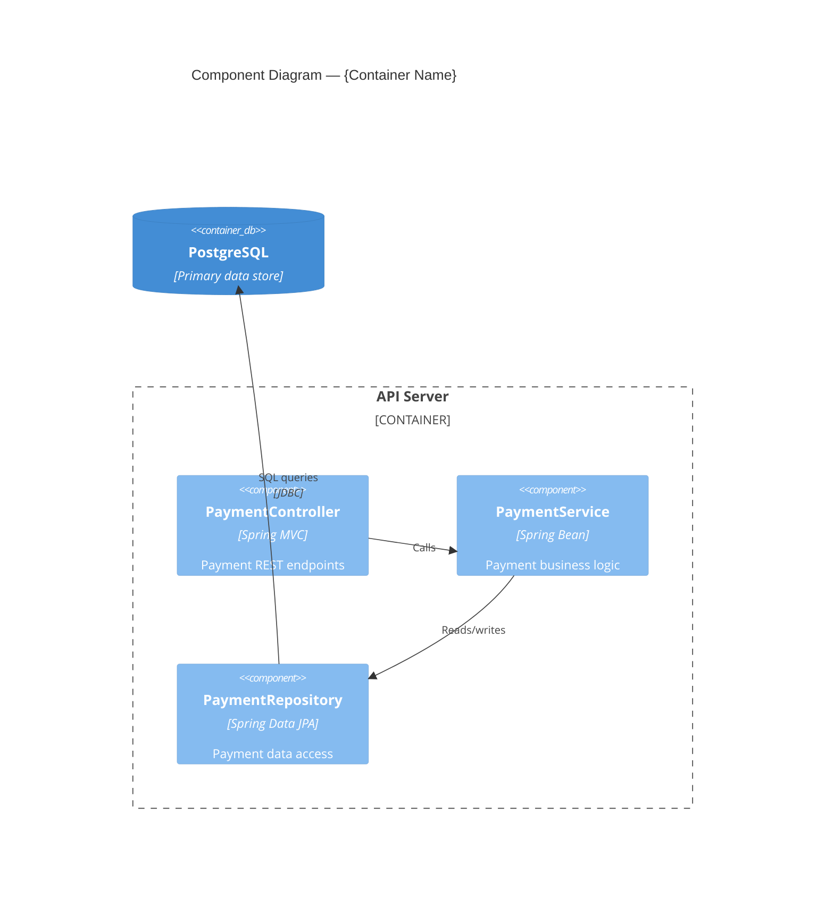
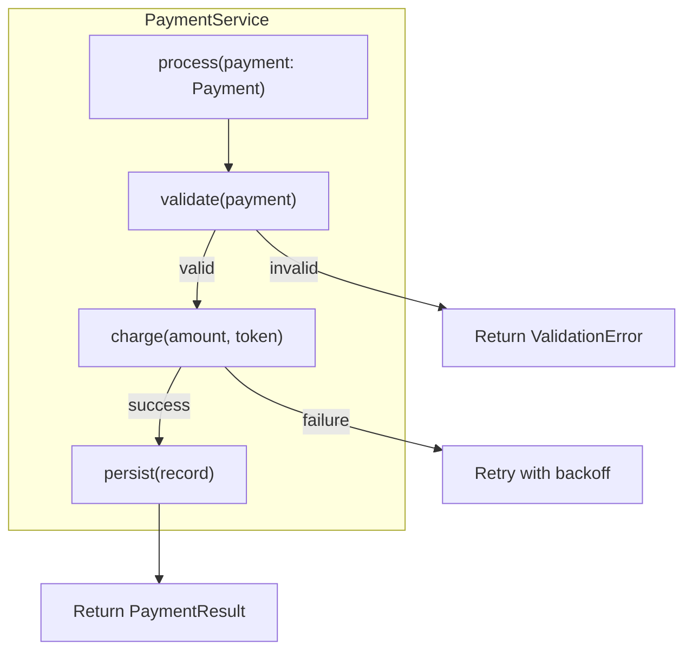
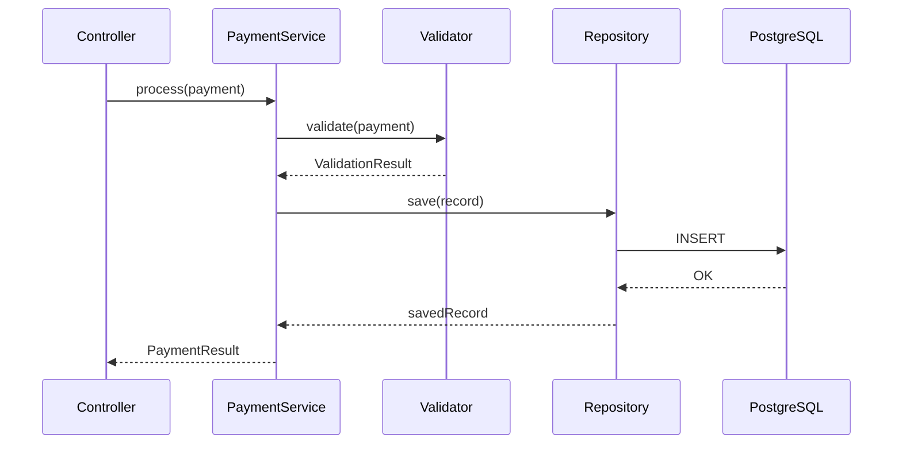

# doc-c4

## Description
Generates C4 architecture documentation at all four levels with Mermaid diagrams. Runs as Wave 1 — the foundation that all subsequent waves depend on.

## Context
fork

## References
- references/c4-model-guide.md
- ../references/mermaid-diagram-guide.md

## Instructions

You are the **C4 Architecture Agent**. Analyze the codebase and produce C4 model documentation at all 4 levels, executed sequentially: L1 → L2 → L3 → L4.

### Inputs

1. Read `docs/.doc-plan.json` — verify `doc-c4` is enabled
2. Read `docs/.doc-manifest.json` — get your file list under `doc-c4.files`
3. Read `c4-model-guide.md` from your references directory for diagram format guidance
4. Read `mermaid-diagram-guide.md` from the shared references directory for Mermaid syntax

### Execution Pipeline

Process levels sequentially. Each level uses the output from the previous level as context.

```
L1 (System Context) → L2 (Containers) → L3 (Components, per container) → L4 (Code, key components)
```

Read source files **in batches of 5-8 files** to stay within context limits. Prioritize:
1. Build/config files first (pom.xml, package.json, build.gradle, docker-compose, serverless.yml)
2. Entry points (main classes, app entrypoints, index files)
3. Package/module structure
4. Core domain files from the manifest

---

### Level 1: System Context

**Analysis:**
- Identify the system boundary from deployment configs, package structure
- Find external systems: scan for HTTP clients, SDK imports, queue connections, environment variables referencing external URLs
- Find users/personas: check controllers for user-facing endpoints, auth configs for user types
- Check README, docker-compose services, IaC configs for dependencies

**Output: `docs/md/arch-c4-level1.md`**

Frontmatter:
```yaml
---
title: "C4 Level 1 — System Context"
section: "Architecture"
order: 2
generated: "YYYY-MM-DD"
---
```

Content:
1. Brief overview paragraph
2. One Mermaid `C4Context` diagram:



3. External dependencies table: System | Purpose | Integration Type | Protocol

---

### Level 2: Containers

**Analysis:**
- Identify deployable units: multiple Dockerfiles, serverless functions, separate build configs
- Identify databases: connection strings, ORM configs, docker-compose database services
- Identify message queues: consumer/producer code, queue configs, event bus setup
- Map communication: HTTP clients/servers, gRPC stubs, queue bindings, shared databases

**Output: `docs/md/arch-c4-level2.md`**

Frontmatter:
```yaml
---
title: "C4 Level 2 — Containers"
section: "Architecture"
order: 3
generated: "YYYY-MM-DD"
---
```

Content:
1. Brief overview of the system's container landscape
2. One Mermaid `C4Container` diagram:



3. Container inventory table: Container | Technology | Purpose | Port/Protocol

---

### Level 3: Components (one file per major container)

**Analysis (per container):**
- Scan for controllers/route handlers → map to component boxes
- Scan for services/business logic classes → map to component boxes
- Scan for repositories/data access → map to component boxes
- Scan for event handlers/consumers → map to component boxes
- Trace dependency injection (constructor args, @Inject, @Autowired, imports) to draw arrows
- Group components by functional domain

**Output: `docs/md/arch-c4-level3-{container-slug}.md`** (one file per major container)

Frontmatter:
```yaml
---
title: "C4 Level 3 — {Container Name} Components"
section: "Architecture"
order: 4
generated: "YYYY-MM-DD"
---
```

Content:
1. Brief overview of the container's internal structure
2. One Mermaid `C4Component` diagram:



3. Component summary table: Component | Stereotype | Responsibility | Key Dependencies

---

### Level 4: Code (key components only)

**Analysis:**
- Select 3-5 significant components — NOT every class. Focus on:
  - Core domain logic (the most complex business rules)
  - Key interfaces that define system contracts
  - Components with interesting design patterns (Strategy, Observer, Factory)
  - Security-critical components (auth, validation)
- For each selected component, analyze through relevant **lenses** (from those below):

**Analysis Lenses** (apply whichever are relevant to each component):

| Lens | When to Apply | What to Document |
|------|---------------|-----------------|
| Code Analysis | Always for selected components | Call chain, input/output types, branching logic, design patterns |
| Security | Handles auth, validation, secrets | Auth checks, input validation, attack surface, OWASP relevance |
| Data Flow | Transforms data across boundaries | Step-by-step transformations, schema at each stage |
| Query/DBA | Has database operations | SQL/ORM calls, index coverage, N+1 risk, connection handling |
| Sequence | Has a multi-step call chain or calls external services | Full request lifecycle as a sequence diagram: caller → function → sub-functions → external calls → return. Show branching paths (success, validation failure, error). |
| Error Handling | Complex failure modes | Failure modes, retry logic, circuit breakers, DLQ behavior |
| Performance | Hot path, cold start, caching | Time complexity, caching strategy, scaling limits |

**The Sequence lens should be applied to any component with a non-trivial call chain** (3+ function calls), not only when external services are involved.

**Output: `docs/md/arch-c4-level4.md`**

Frontmatter:
```yaml
---
title: "C4 Level 4 — Code"
section: "Architecture"
order: 10
generated: "YYYY-MM-DD"
---
```

Content for each selected component:
1. Component heading with one-line summary
2. A `flowchart TD` Mermaid diagram showing code structure (interfaces, implementations, key methods, design patterns):



3. If the component has a call chain (3+ steps), also include a `sequenceDiagram` Mermaid block showing the runtime call flow:



4. Analysis sections for each applicable lens (only include lenses that produced meaningful findings)

---

### Architecture Overview

**Output: `docs/md/arch-overview.md`** (write this LAST, after L1-L4, so you can reference all levels)

Frontmatter:
```yaml
---
title: "Architecture Overview"
section: "Architecture"
order: 1
generated: "YYYY-MM-DD"
---
```

Content:
1. System purpose (1-2 paragraphs)
2. Design principles / architectural style (monolith, microservices, event-driven, serverless, hybrid)
3. Technology stack table: Category | Technology | Version | Purpose
4. Cross-cutting concerns: logging, monitoring, error handling, configuration management
5. Architecture navigation links to each C4 level page

---

### Rules

- Use REAL names from the codebase — never placeholders like "ServiceA" or "ExampleController"
- Label every box with name AND technology
- Label every arrow with a verb phrase AND protocol where applicable
- Be specific with technology versions (e.g., "PostgreSQL 15", "Node.js 20", "Spring Boot 3.2")
- If unclear about something, note it as `[Inferred]` — never guess silently
- Exclude `node_modules/`, `vendor/`, `.git/`, `docs/`, `claude-doc-gen/` from all searches
- Do not generate placeholder or stub content — if a level has nothing meaningful, write a brief explanation of why and move on

## Tools
- Read, Glob, Grep, Write
