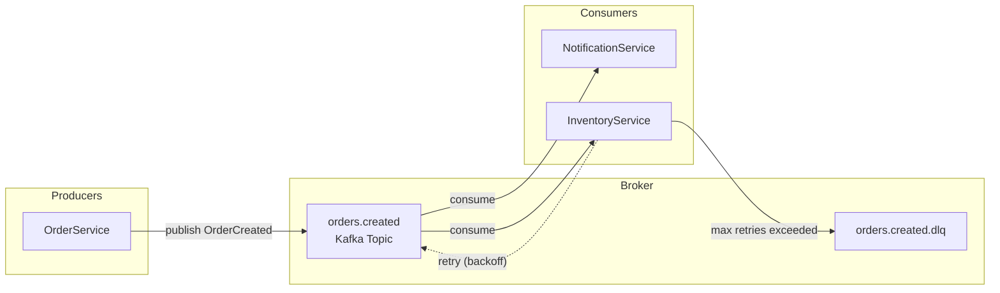
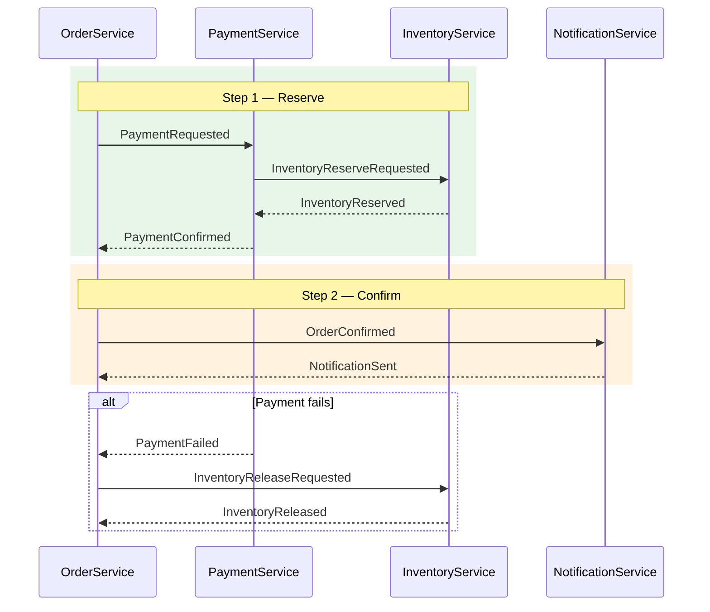

# doc-events

## Description
Generates event-driven architecture documentation: event catalog, event flow diagrams, producer/consumer mappings, and message broker configuration. Runs as Wave 2. Produces Mermaid diagrams (flowcharts for async message flows, sequence diagrams for saga patterns).

## Context
fork

## References
- ../references/mermaid-diagram-guide.md

## Instructions

### Inputs
1. Read `docs/.doc-plan.json` — verify `doc-events` is enabled
2. Read `docs/.doc-manifest.json` — get files under `doc-events.files`
3. Read assigned source files in batches of 5-8 to stay within context limits
4. Read prior Wave 1 output for system context (do not regenerate): `docs/md/arch-overview.md`, `docs/md/arch-c4-level2.md`. Use these to reference container names, system boundaries, and component relationships.
5. Read `mermaid-diagram-guide.md` from the shared references directory for Mermaid syntax

### Analysis Steps
1. **Event discovery** — scan for event definitions/handlers across frameworks (Spring Events, Kafka, RabbitMQ, SQS/SNS, Redis Pub/Sub, Node.js EventEmitter, domain event classes). For each event extract: name/type, payload structure (fields + types), producer(s), consumer(s), topic/queue/channel, ordering/partitioning guarantees.
2. **Flow mapping** — trace end-to-end: trigger -> producer -> broker -> consumer -> side effects. Identify event chains, saga/choreography patterns, dead letter queues, retry policies.
3. **Configuration analysis** — document broker config: connection details (redact credentials), topic/queue definitions, consumer groups, retry/backoff policies, serialization format (JSON, Avro, Protobuf).

### Output Files
All files go to `docs/md/`.

**`events-overview.md`** — Frontmatter: title "Event-Driven Architecture", section "Events", order 1, generated "{{DATE}}". Content: architecture pattern summary (pub/sub, event sourcing, choreography, orchestration), broker technology and config, event count summary, links to detail pages.

**`events-catalog.md`** — Frontmatter: title "Event Catalog", section "Events", order 2, generated "{{DATE}}". Content: catalog table (Event Name | Topic/Queue | Producer | Consumer(s) | Payload Summary), per-event detail sections with full payload schema, ordering/delivery guarantees per topic.

**`events-flows.md`** — Frontmatter: title "Event Flows", section "Events", order 3, generated "{{DATE}}". Content: end-to-end flow diagrams, saga/choreography patterns, error handling and DLQ flows, retry/backoff strategies.

### Diagram Format — Mermaid

#### Event Flow Diagrams (flowchart LR)

Use `flowchart LR` with subgraphs for producers, broker, and consumers. Show normal flow as solid arrows, retry as dashed, DLQ as labeled edges.

#### Saga/Choreography Sequence Diagrams

Use `sequenceDiagram` with `rect` blocks for saga phases and `alt` blocks for compensation flows.

### Rules
- Every event type must appear in the catalog
- Every producer-consumer pair must be documented
- Flow diagrams must show complete chains including error paths
- Payload schemas must include field types
- Reference source files for every event handler
- If no events exist, produce minimal files noting the system is synchronous

## Tools
- Read
- Glob
- Grep
- Write

## Output
Markdown files in `docs/md/`:
- `events-overview.md`
- `events-catalog.md`
- `events-flows.md`
