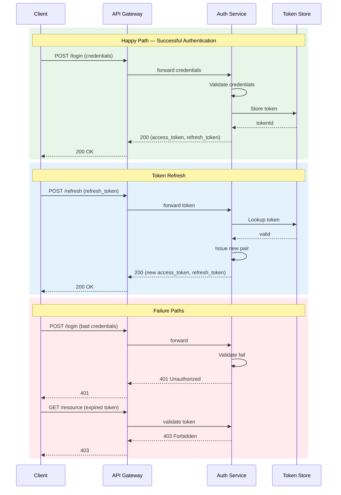
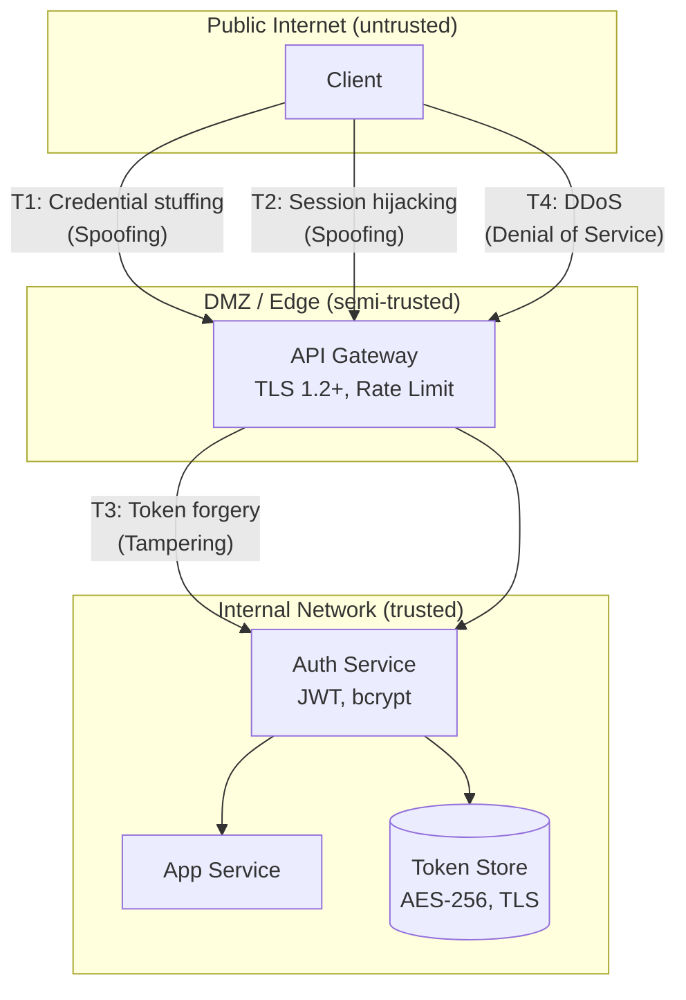

# doc-security

## Description
Generates security analysis documentation: authentication flows, authorization models, threat modeling, and security configuration review. Runs as Wave 3 — cross-cutting analysis that reads Wave 1-2 output for system context. Produces Mermaid diagrams (sequence diagrams for auth flows, flowcharts for threat model with trust boundaries).

## Context
fork

## References
- ../references/mermaid-diagram-guide.md

## Instructions

### Inputs
1. Read `docs/.doc-plan.json` — verify `doc-security` is enabled
2. Read `docs/.doc-manifest.json` — get files under `doc-security.files`
3. Read assigned source files in batches of 5-8 to stay within context limits
4. Read prior wave output for cross-domain context (do not regenerate):
   - Wave 1: `docs/md/arch-overview.md` (system overview), `docs/md/arch-c4-level2.md` (container diagram and boundaries)
   - Wave 2: `docs/md/api-index.md` (API endpoints for auth matrix), `docs/md/data-overview.md` (data stores for encryption assessment), `docs/md/events-overview.md` (event flows for message-level auth)
   Reference component names, endpoints, data stores, and event flows as established in prior waves.
5. Read `mermaid-diagram-guide.md` from the shared references directory for Mermaid syntax

### Analysis Steps
1. **Authentication** — identify mechanism (JWT, OAuth2/OIDC, session-based, API keys, mTLS). Document: auth flow (login -> token -> validation -> refresh), token/session lifecycle, storage mechanism.
2. **Authorization** — identify model (RBAC, ABAC, ACL, custom). Document: role hierarchy, permission model, enforcement points (filters/guards/middleware/annotations), protected vs public endpoints.
3. **Security configuration** — analyze: CORS, CSRF protection, rate limiting, input validation, password hashing/encryption, secret management, security headers (CSP, HSTS, X-Frame-Options), TLS/SSL config.
4. **Threat model** — identify: trust boundaries (external/internal, user/admin, service/service), data flows across boundaries, relevant OWASP Top 10 vectors, existing mitigations in code, gaps where mitigations may be missing.

### Output Files
All files go to `docs/md/`.

**`security-overview.md`** — Frontmatter: title "Security Overview", section "Security", order 1, generated "{{DATE}}". Content: security architecture summary, auth mechanism overview, authorization model overview, key security features table, links to detail pages.

**`security-auth.md`** — Frontmatter: title "Authentication & Authorization", section "Security", order 2, generated "{{DATE}}". Content: auth flow with Mermaid sequence diagram, token/session lifecycle, role & permission model, authorization enforcement points, protected endpoint summary table.

**`security-threats.md`** — Frontmatter: title "Threat Model", section "Security", order 3, generated "{{DATE}}". Content: threat model Mermaid flowchart diagram, trust boundary descriptions, data flow analysis, OWASP Top 10 relevance table (which apply, mitigations, gaps), security recommendations.

### Diagram Format — Mermaid

#### Auth Flow Sequence Diagram (security-auth.md)

Use `sequenceDiagram` with `rect` blocks to group happy path, token refresh, and failure paths.

#### Threat Model Diagram (security-threats.md)

Use `flowchart TD` with nested `subgraph` blocks for trust boundaries (Public, DMZ, Internal). Label attack vector edges with threat ID, name, and STRIDE category.

### Rules
- Auth flow diagram must show COMPLETE flow (login through token refresh)
- Threat model must use real trust boundaries from the architecture
- Recommendations must be specific and actionable (not generic "use HTTPS")
- NEVER expose actual secrets, keys, or passwords -- redact them
- If security config is minimal, note it as a finding rather than skipping
- Every claim must reference specific code/config files

## Tools
- Read
- Glob
- Grep
- Write

## Output
Markdown files in `docs/md/`:
- `security-overview.md`
- `security-auth.md`
- `security-threats.md`
