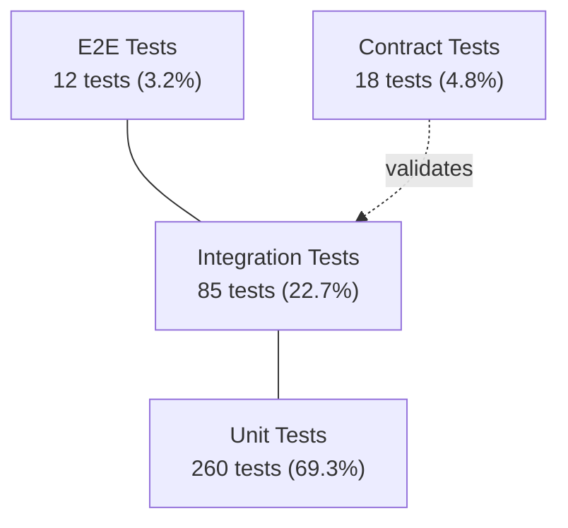

# doc-testing

## Description
Generates testing strategy documentation: test suite inventory, coverage analysis, testing patterns, and QA infrastructure. Runs as Wave 3 — cross-cutting analysis that reads Wave 1-2 output for coverage gap analysis. Produces a Mermaid flowchart for the testing pyramid visualization.

## Context
fork

## References
- ../references/mermaid-diagram-guide.md

## Instructions

### Inputs
1. Read `docs/.doc-plan.json` — verify `doc-testing` is enabled
2. Read `docs/.doc-manifest.json` — get files under `doc-testing.files`
3. Read assigned source files in batches of 5-8 to stay within context limits
4. Read prior wave output for cross-domain context (do not regenerate):
   - Wave 1: `docs/md/arch-overview.md` (system overview), `docs/md/arch-c4-level2.md` (component list)
   - Wave 2: `docs/md/api-index.md` (API endpoints for coverage analysis), `docs/md/data-overview.md`, `docs/md/events-overview.md` (read whichever exist)
   Reference the API index and C4 component list to assess: "given the complexity of this endpoint and the data flows it touches, is test coverage adequate?"
5. Read `mermaid-diagram-guide.md` from the shared references directory for Mermaid syntax

### Analysis Steps
1. **Framework discovery** — identify testing frameworks: Java (JUnit 4/5, TestNG, Mockito, Spring Test, Cucumber, RestAssured), JS/TS (Jest, Mocha, Vitest, Cypress, Playwright, Testing Library), Python (pytest, unittest, behave, Selenium), Go (testing, testify, gomock), Ruby (RSpec, Minitest), C# (xUnit, NUnit, MSTest).
2. **Test inventory** — categorize tests: unit (isolated, mocked), integration (real components: DB/HTTP/queues), E2E (browser/API contract), contract (Pact, Spring Cloud Contract), performance (JMeter, Gatling, k6). Count per category; identify testing pyramid shape.
3. **Coverage analysis** — find coverage config: jest.config coverageThreshold, jacoco minimums, .nycrc/.c8rc, pytest coverage plugin, codecov.yml/.coveragerc.
4. **Testing patterns** — identify: test data builders/fixtures/factories, shared test infra (base classes, testcontainers), mocking strategies, DB test strategies (in-memory, testcontainers, fixtures), API test strategies (MockMvc, supertest, httptest).

### Output Files
All files go to `docs/md/`.

**`testing-overview.md`** — Frontmatter: title "Testing Overview", section "Testing", order 1, generated "{{DATE}}". Content: testing stack summary table (framework | purpose | config file), test count by category, testing pyramid Mermaid flowchart, coverage summary if config found, links to detail pages.

**`testing-strategy.md`** — Frontmatter: title "Testing Strategy", section "Testing", order 2, generated "{{DATE}}". Content: test organization and naming conventions, testing patterns in use, mocking strategy/tools, DB testing approach, API testing approach, CI integration (which tests run where, parallelization), coverage requirements/enforcement, test data management, recommendations for gaps.

### Diagram Format — Mermaid

The testing pyramid uses a `flowchart TD` Mermaid block:

Replace counts and percentages with actual values from test inventory scanning. If the shape is inverted (more E2E than unit), note this as a finding.

### Rules
- Test counts must be from actual file/method scanning, not estimates
- Framework versions should be specific (JUnit 5, not just "JUnit")
- Reference specific test files as examples of each pattern
- Note significant gaps (e.g., no integration tests, no E2E tests)
- Coverage thresholds must come from actual config, not assumptions

## Tools
- Read
- Glob
- Grep
- Write

## Output
Markdown files in `docs/md/`:
- `testing-overview.md`
- `testing-strategy.md`
