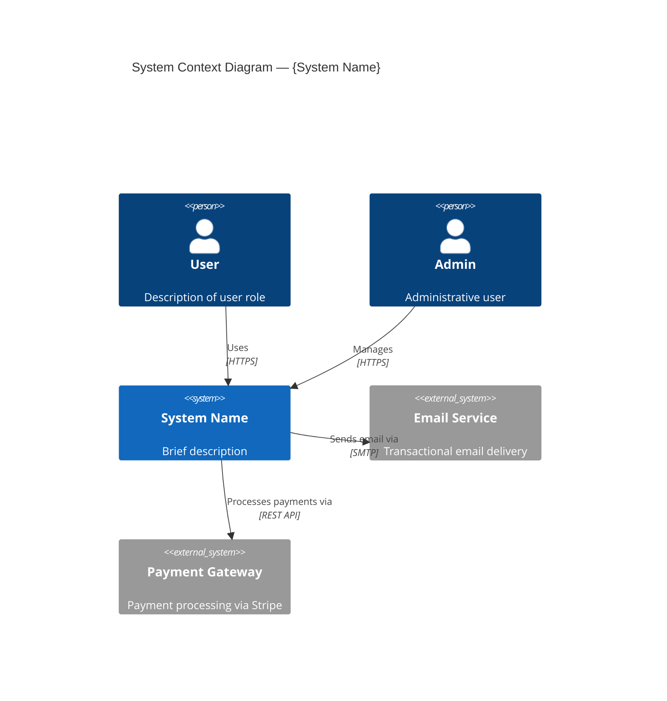
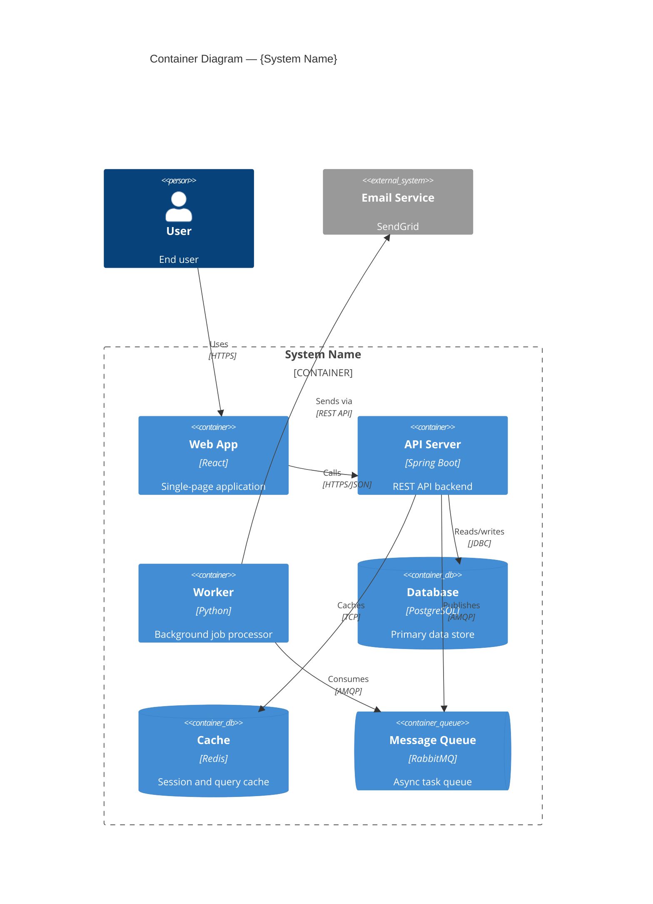
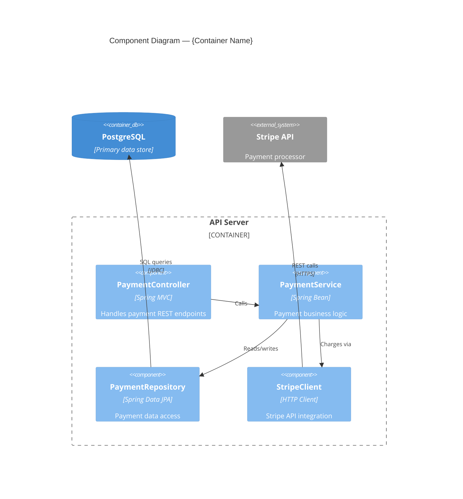
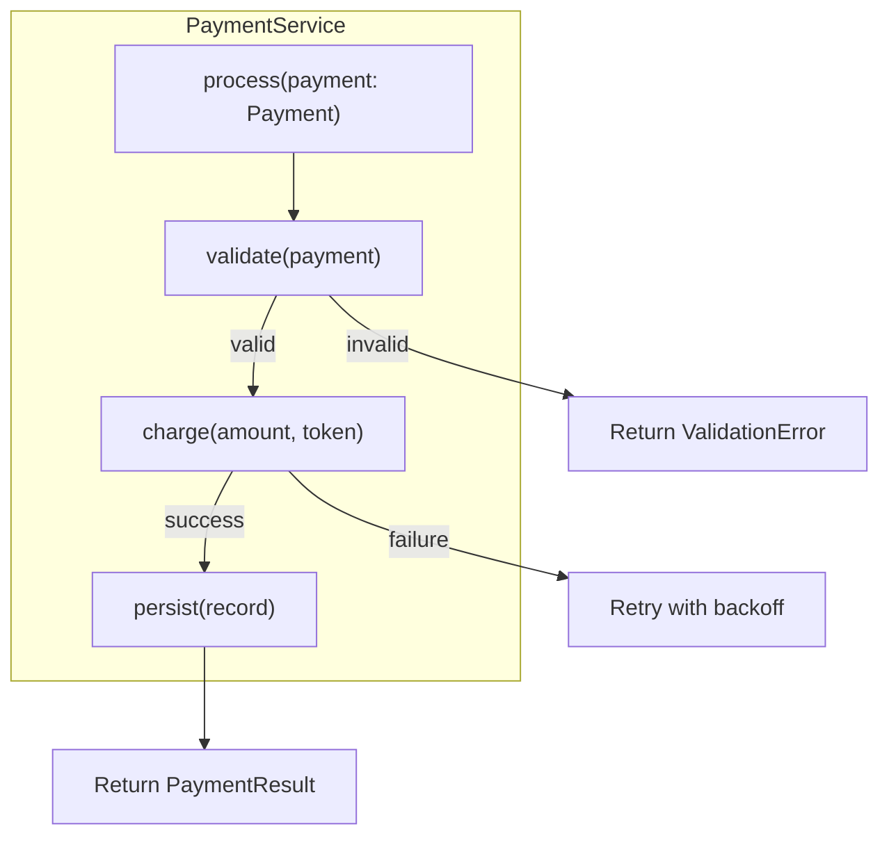
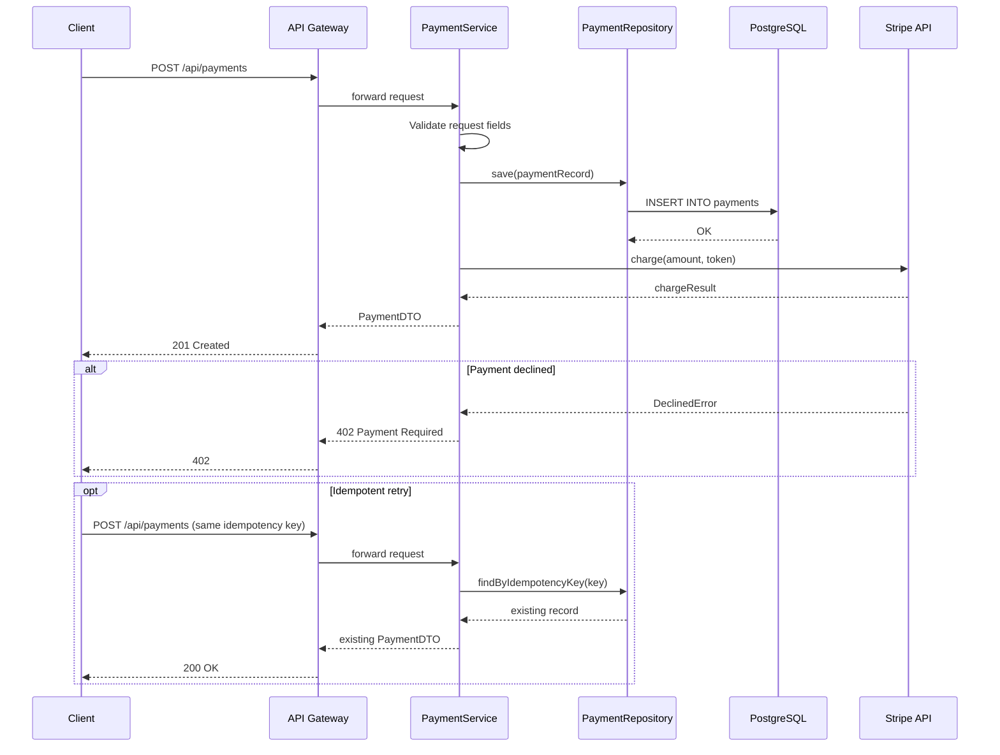
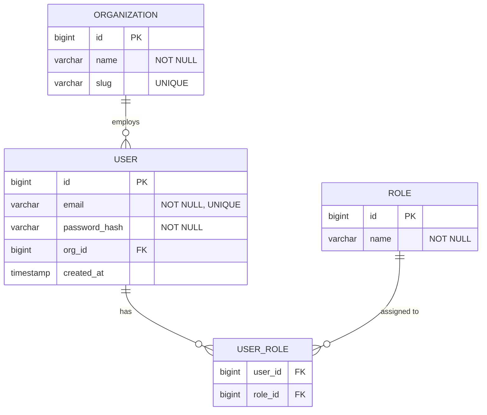
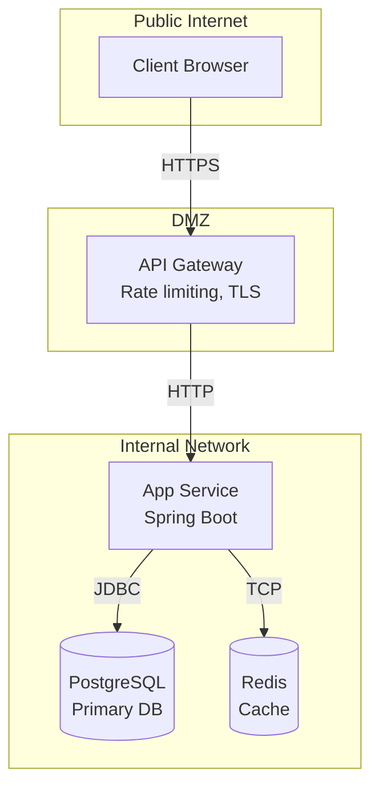
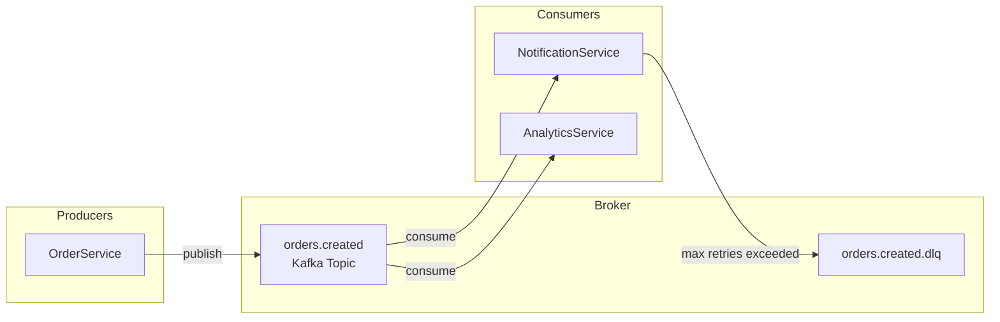

# Mermaid Diagram Syntax Guide

Shared reference for all diagram-producing skills. Every diagram in Phase 1 markdown output MUST be a fenced Mermaid code block. No ASCII art, no `<!-- diagram-meta -->` YAML, no `<!-- diagram:type:name -->` markers.

---

## General Rules

1. Every diagram is a fenced code block starting with `` ```mermaid `` and ending with `` ``` ``
2. The first line inside the fence declares the diagram type
3. Use **real names** from the codebase — never placeholders like "ServiceA" or "ExampleController"
4. No color metadata, no style directives — the MkDocs plugin handles all styling
5. Keep labels concise but specific (include technology where relevant)
6. One diagram per fenced block — never combine multiple diagram types in one block

---

## C4 Diagrams

### C4 Context (Level 1)



**Elements:** `Person(id, label, description)`, `System(id, label, desc)`, `System_Ext(id, label, desc)`
**Relationships:** `Rel(from, to, label)` or `Rel(from, to, label, technology)`

### C4 Container (Level 2)



**Elements:** `Container(id, label, technology, desc)`, `ContainerDb(...)`, `ContainerQueue(...)`
**Boundaries:** `Container_Boundary(id, label) { ... }`

### C4 Component (Level 3)



**Elements:** `Component(id, label, technology, desc)`

### C4 Code (Level 4) — Use flowchart

For code-level detail, use `flowchart TD` since Mermaid has no C4 code diagram type:



---

## Sequence Diagrams



**Participants:** `participant ALIAS as "Display Name"`
**Arrows:**
- `->>` solid arrow (synchronous request)
- `-->>` dashed arrow (response / return)
- `-x` solid with X (failed/rejected)
- `--x` dashed with X

**Blocks:** `alt`/`else`, `opt`, `loop`, `rect`, `Note over A,B: text`

---

## Entity Relationship Diagrams



**Entities:** Declare with `ENTITY_NAME { type field_name constraint "description" }`
**Relationships:**
- `||--||` one-to-one
- `||--o{` one-to-many
- `o{--o{` many-to-many (use join table)
- `||--o|` one-to-zero-or-one

---

## Flowcharts

### Top-to-bottom (TD) — for hierarchical flows, infrastructure topology



### Left-to-right (LR) — for pipelines, data flows, CI/CD, event flows



**Node shapes:**
- `["text"]` rectangle (default)
- `("text")` rounded rectangle / stadium
- `[("text")]` cylinder (database)
- `{"text"}` diamond (decision)
- `{{"text"}}` hexagon
- `(["text"])` stadium
- `(("text"))` circle

**Subgraphs:** `subgraph Title ... end` — nest for boundaries (region > VPC > subnet)

**Edge labels:** `-->|label text|` or `-- label text -->`

---

## Diagram Type Mapping

| Documentation context | Mermaid diagram type |
|---|---|
| C4 Level 1 — System Context | `C4Context` |
| C4 Level 2 — Containers | `C4Container` |
| C4 Level 3 — Components | `C4Component` |
| C4 Level 4 — Code structure | `flowchart TD` |
| API request lifecycle | `sequenceDiagram` |
| Auth flow | `sequenceDiagram` with `rect` blocks |
| Database schema / ERD | `erDiagram` |
| Data pipeline / flow | `flowchart LR` |
| Event flow (pub/sub) | `flowchart LR` with subgraphs |
| Saga / choreography | `sequenceDiagram` with `rect` blocks |
| CI/CD pipeline | `flowchart LR` with decision diamonds |
| Infrastructure topology | `flowchart TD` with nested subgraphs |
| Threat model | `flowchart TD` with subgraphs for trust boundaries |
