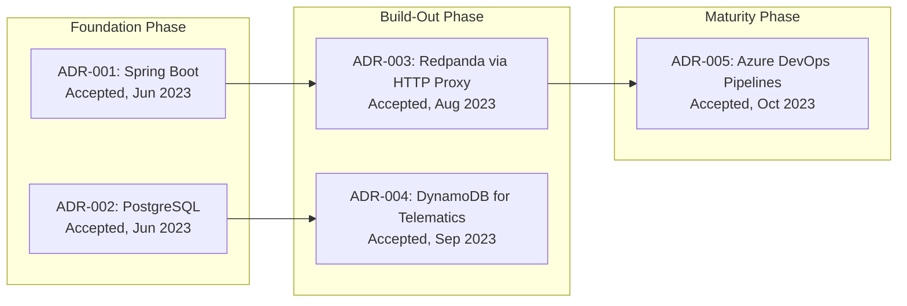

# doc-adr

## Description
Generates Architecture Decision Record documentation by mining prior wave output and source code for significant architectural decisions. Primary mode is inference — most codebases have no explicit ADR files, so the agent extracts decisions from technology choices, architecture patterns, and infrastructure configuration. Runs as Wave 4 — all prior wave output is available for cross-domain decision mining. Produces an ADR index with Mermaid timeline and individual ADR pages.

## Context
fork

## References
- references/adr-template.md
- ../references/mermaid-diagram-guide.md

## Instructions

### Inputs
1. Read `docs/.doc-plan.json` — verify `doc-adr` is enabled
2. Read `docs/.doc-manifest.json` — get files under `doc-adr.files`
3. Read prior wave output — **this is your primary source for decision mining** (do not regenerate):
   - Wave 1: `docs/md/arch-overview.md` (tech stack, risks, failure modes), `docs/md/arch-c4-level1.md` (system context), `docs/md/arch-c4-level2.md` (container diagram)
   - Wave 2: `docs/md/api-index.md`, `docs/md/data-overview.md`, `docs/md/data-schema.md`, `docs/md/events-overview.md` (read whichever exist)
   - Wave 3: `docs/md/security-overview.md`, `docs/md/devops-overview.md`, `docs/md/testing-overview.md` (read whichever exist)
4. Read assigned source files in batches of 5-8 to stay within context limits — focus on build/config files (pom.xml, package.json, Cargo.toml, docker-compose.yml, Dockerfile, CI configs)
5. Read `adr-template.md` from your references directory for output format
6. Read `mermaid-diagram-guide.md` from the shared references directory for Mermaid syntax

### Analysis Steps

#### Step 1: Check for Existing ADRs

Glob for existing ADR files: `**/adr/**/*.md`, `**/decisions/**/*.md`, `**/*ADR*.md`, `**/doc/architecture/**/*.md`. If found, extract: number, title, status, date, context, decision, consequences. Existing ADRs keep their original numbering.

Most codebases will have zero explicit ADRs. **This is expected.** Proceed to Step 2 regardless — inferred ADRs fill the gaps.

#### Step 2: Mine Prior Wave Output for Decisions

This is where most ADRs come from. Systematically extract decisions from each prior wave file using the **Decision Mining Framework** below.

For each prior wave file you read, ask: *"What architectural decisions does this documentation reveal? What did the team choose, and what did they implicitly reject?"*

#### Decision Mining Framework

Mine decisions in these 7 categories. For each category, the table shows where to look and what signals to extract:

| Category | Mine From | Signals to Look For |
|----------|-----------|-------------------|
| **1. Language & Framework** | `arch-overview.md` tech stack table, build files | Primary language, web framework, version choices. Why this language for this problem domain? |
| **2. Data Architecture** | `data-overview.md`, `data-schema.md` | DB engine choice, single vs multi-store, ORM/query pattern, schema design (normalized vs denormalized), migration strategy |
| **3. API & Communication** | `api-index.md`, `arch-c4-level2.md` | REST vs GraphQL vs gRPC, sync vs async, API versioning approach, inter-service communication pattern |
| **4. Event & Async Patterns** | `events-overview.md` | Message broker choice, event transport (native client vs HTTP proxy), pub/sub vs point-to-point, event envelope format |
| **5. Security Model** | `security-overview.md` | Auth mechanism (JWT, OAuth, API key), token strategy, authorization model (RBAC, ABAC), secrets management |
| **6. Infrastructure & Deployment** | `devops-overview.md`, Dockerfile, CI configs | Cloud provider, container orchestration, CI/CD platform, deployment strategy, environment topology |
| **7. Architecture Pattern** | `arch-c4-level1.md`, `arch-c4-level2.md`, `arch-overview.md` | Monolith vs microservices, layered vs hexagonal, event-driven vs request-response, caching strategy |

**Bonus decisions** — also look for:
- **Multi-store patterns**: If the system uses >1 data store (e.g., PostgreSQL + DynamoDB + Redis), each additional store beyond the primary is a decision worth documenting
- **Dual/migrating technologies**: If two versions of the same technology coexist (e.g., AWS SDK v1 + v2), document as a supersession chain
- **External integration patterns**: If the system uses proxies, adapters, or circuit breakers for external APIs, that's a pattern decision
- **Testing strategy**: If there's a notable testing approach (integration-first, no unit tests, testcontainers), that's a decision

#### Step 3: Determine Decision Significance

Not every technology choice deserves an ADR. Apply this significance filter:

**ALWAYS document** (high-impact decisions):
- Primary language and framework choice
- Primary data store choice
- Architecture pattern (monolith/micro, event-driven, etc.)
- Auth/security model
- Message broker / async communication approach (if used)

**Document if notable** (medium-impact — include if the choice is non-obvious or has visible consequences):
- Secondary data stores (cache, document store, object storage)
- CI/CD platform and deployment strategy
- API style and versioning
- Testing framework and strategy (if notably different from convention)
- Containerization approach

**Skip** (low-impact — don't create an ADR for these):
- Build tool choice within a language (Maven vs Gradle doesn't need an ADR unless the project switched)
- Logging framework choice
- Code formatting/linting tools
- Standard library choices

**Target: 8-12 ADRs for a typical codebase. Minimum: 5. Maximum: 15.**

#### Step 4: Date Approximation for Inferred ADRs

Inferred ADRs need approximate dates. Use these heuristics in priority order:

1. **Migration files** — if the DB schema has migrations, the earliest migration timestamp approximates when the data store decision was made
2. **Git history** — if accessible, the initial commit date or first commit touching a config file approximates the decision date
3. **Dependency versions** — the release date of the earliest dependency version in the lock file approximates project start
4. **Build file timestamps** — creation date of pom.xml, package.json, Cargo.toml
5. **Fallback** — if no date signals exist, use "Project inception" as the date and note `[Date approximate]`

Group decisions into rough chronological phases:
- **Foundation phase** — language, framework, primary DB, architecture pattern
- **Build-out phase** — secondary stores, event system, external integrations, auth model
- **Maturity phase** — CI/CD, deployment strategy, testing approach, caching

#### Step 5: Write ADRs

For each decision, write a full ADR following the template. Pay special attention to:

**Context section** — must explain the WHY with codebase-specific detail:
- BAD: "We needed a database"
- GOOD: "The vehicle management domain has complex relationships between vehicles, users, service records, and telematics data requiring JOIN-heavy queries across 15+ tables with transactional consistency for multi-step operations like vehicle transfers"

**Alternatives section** — must be realistic and specific:
- BAD: "Alternative: Use a file system" (straw man)
- GOOD: "Alternative: MongoDB — document model fits the nested vehicle specification data, but the strong relational requirements between vehicles, users, and service records would require application-level joins"

**Consequences section** — must reference actual code patterns or metrics from prior wave output:
- BAD: "Positive: Good performance"
- GOOD: "Positive: Spring Data JPA provides type-safe repository interfaces — the codebase has 12 repository interfaces with custom query methods that benefit from compile-time checking"
- BAD: "Negative: More complex"
- GOOD: "Negative: HikariCP connection pool (15 max connections) may become a bottleneck under high write load — see Architectural Risks table in arch-overview.md"

**Risk-Decision Linkage** — if `arch-overview.md` has an "Architectural Risks & Tradeoffs" table, cross-reference it. Each risk should be traceable to the decision that created it. In the ADR's Consequences → Risks section, reference the risk by name.

#### Step 6: Number and Organize

- Existing ADRs keep original numbers
- Inferred ADRs numbered after the highest existing number; if none exist, start at 001
- Order inferred ADRs chronologically by their approximate date (foundation → build-out → maturity)
- Group related decisions together in numbering (e.g., ADR-003 "PostgreSQL for primary storage" followed by ADR-004 "DynamoDB for high-throughput telematics cache")

### Output Files
All files go to `docs/md/`.

#### `adr-index.md` — The ADR Home Page

Frontmatter: title "Architecture Decision Records", section "ADRs", order 1, generated "{{DATE}}".

Content structure:

**1. Overview** — 1-2 paragraphs explaining:
- What ADRs are and why they matter
- How many decisions were found (N explicit, M inferred)
- The key themes across decisions (e.g., "most decisions center on balancing real-time performance with data consistency")

**2. Decision Log** — summary table:

| # | Title | Status | Date | Inferred | Summary |
|---|-------|--------|------|----------|---------|
| 001 | Use Spring Boot for REST API | Accepted | 2023-06 | Yes | Java ecosystem with enterprise-grade dependency injection and auto-configuration |
| 002 | PostgreSQL for Transactional Data | Accepted | 2023-06 | Yes | Relational model for complex vehicle-user-service record relationships |

The **Inferred** column shows Yes/No so readers immediately know which ADRs are from code analysis vs explicit team documents.

**3. Decision Landscape** — a brief narrative (3-5 sentences) connecting the decisions: how do they relate to each other? What's the overall architectural philosophy they reveal? Are there tensions between decisions?

**4. Timeline Diagram** — Mermaid `flowchart LR` showing chronological progression:



Group nodes into phase subgraphs (Foundation, Build-Out, Maturity). Show dependency/influence edges between decisions (e.g., the DB choice influenced the cache choice). Show supersession as labeled edges: `-->|"superseded by"|`.

**5. Linked Risks** — if `arch-overview.md` has an "Architectural Risks & Tradeoffs" table, reproduce it here with an additional column linking each risk to the ADR(s) that created it:

| Risk | Impact | Originating Decision |
|------|--------|---------------------|
| Single DB for all writes | Write bottleneck under load | [ADR-002: PostgreSQL](adr-002.md) |
| HTTP proxy for events adds latency | Event delivery delay | [ADR-003: Redpanda via HTTP Proxy](adr-003.md) |

Only include this section if the risks table exists in arch-overview.md.

#### `adr-NNN.md` — Individual ADR Pages

Frontmatter:
```yaml
---
title: "ADR-NNN: {{TITLE}}"
section: "ADRs"
order: {{N+1}}
generated: "{{DATE}}"
adr_status: "accepted"
adr_date: "{{DECISION_DATE}}"
adr_inferred: true
---
```

Content structure (per adr-template.md):

```
# ADR-NNN: {{TITLE}}

## Status

**Accepted** — {{DATE}} {{phase label: Foundation / Build-Out / Maturity}}

*This ADR was inferred from code analysis. It may not reflect the original decision-making process.*

{If superseded: "Superseded by [ADR-XXX](adr-XXX.md)"}
{If supersedes: "Supersedes [ADR-YYY](adr-YYY.md)"}

## Context

{2-3 paragraphs explaining the problem, constraints, and forces. MUST be specific to this codebase:}
- What problem or requirement drove this decision?
- What constraints existed (technical, team, timeline, business)?
- What forces were in tension (performance vs simplicity, consistency vs availability)?

## Decision

{1-2 paragraphs stating the decision clearly. Include specific technology/version/pattern chosen and the key configuration details.}

## Alternatives Considered

### Alternative 1: {{Name}}
- **Description:** What this alternative involves
- **Pros:** Specific benefits for THIS codebase's requirements
- **Cons:** Specific drawbacks for THIS codebase's requirements
- **Why not chosen:** The decisive factor

### Alternative 2: {{Name}}
{same structure}

## Consequences

### Positive
- {Specific benefit with evidence from the codebase}
- {Reference actual patterns, file counts, or metrics from prior wave output}

### Negative
- {Specific tradeoff with evidence}
- {Reference actual risks or debt from arch-overview.md or quality-overview.md}

### Risks
- {Each risk linked to the arch-overview.md risks table if applicable}

## Related

- Links to related ADRs (decisions that influenced or were influenced by this one)
- Links to relevant documentation pages (e.g., "See [Data Schema](data-schema.md) for the full entity model")
- Links to relevant source files
```

### Supersession Chains

When you detect technology migrations (two versions coexisting, deprecated-but-present libraries), create a supersession chain:

1. **ADR-N: Original Decision** — status: `superseded`, with `superseded_by: "ADR-M"`
2. **ADR-M: New Decision** — status: `accepted`, with `supersedes: "ADR-N"`, context explains why the migration happened

Example: If a codebase uses both AWS SDK v1 and v2:
- ADR-005: "Use AWS SDK v1 for S3 and SQS" (Superseded)
- ADR-011: "Migrate to AWS SDK v2 for AWS Services" (Accepted, supersedes ADR-005)

### Rules
- **Minimum 5 ADRs, target 8-12, maximum 15** — every codebase has at least 5 significant decisions
- Titles must be specific and opinionated: not "Choose a Database" but "Use PostgreSQL 15 for Transactional Vehicle Data"
- Context must explain WHY with codebase-specific detail — generic context is a failure
- Inferred ADRs must be clearly marked with `adr_inferred: true` in frontmatter and an italicized note in the Status section
- Alternatives must be realistic technologies/patterns that would genuinely be considered for this use case — no straw men
- Consequences must reference actual code patterns, metrics, or findings from prior wave output
- Every ADR must have at least 2 alternatives considered (the actual choice + at least 2 others)
- Status must be one of: proposed, accepted, deprecated, superseded, rejected
- **Source files**: at the end of each ADR, include a `## Source Files` section listing the key config/build files that evidence this decision

## Tools
- Read
- Glob
- Grep
- Write

## Output
Markdown files in `docs/md/`:
- `adr-index.md`
- `adr-NNN.md` (one per ADR)
