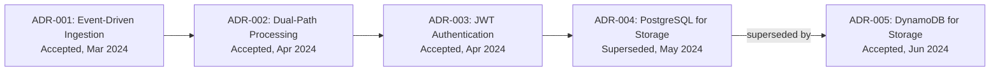

# doc-adr

## Description
Generates Architecture Decision Record documentation. Discovers existing ADRs or infers decisions from code patterns. Produces an ADR index and individual ADR pages. Runs as Wave 4 — assessment phase that reads all prior wave output for context. ADR timeline uses a Mermaid flowchart diagram.

## Context
fork

## References
- references/adr-template.md
- ../references/mermaid-diagram-guide.md

## Instructions

### Inputs
1. Read `docs/.doc-plan.json` — verify `doc-adr` is enabled
2. Read `docs/.doc-manifest.json` — get files under `doc-adr.files`
3. Read assigned source files in batches of 5-8 to stay within context limits
4. Read prior wave output for full system context (do not regenerate):
   - Wave 1: `docs/md/arch-overview.md` (system overview), `docs/md/arch-c4-level2.md` (container diagram)
   - Wave 2: `docs/md/api-index.md`, `docs/md/data-overview.md`, `docs/md/events-overview.md` (read whichever exist)
   - Wave 3: `docs/md/security-overview.md`, `docs/md/devops-overview.md`, `docs/md/testing-overview.md` (read whichever exist)
   Use these to cross-reference architectural decisions with actual implementation.
5. Read `mermaid-diagram-guide.md` from the shared references directory for Mermaid syntax

### Analysis Steps
1. **Find existing ADRs** — glob `**/adr/**/*.md`, `**/decisions/**/*.md`, `**/*ADR*.md`. Extract: number, title, status, date, context, decision, consequences.
2. **Infer decisions from code** — if few explicit ADRs exist, analyze for implicit decisions: technology choices (build system, framework, DB, cache, message queue from config/build files), architecture choices (monolith vs micro, sync vs async, API style, auth approach), pattern choices (layered arch, event sourcing/CQRS, DDD from package structure).
3. **Number and organize** — existing ADRs keep original numbers; inferred ADRs numbered after highest existing; if none exist start at 001.

### Output Files
All files go to `docs/md/`.

**`adr-index.md`** — Frontmatter: title "Architecture Decision Records", section "ADRs", order 1, generated "{{DATE}}". Content: brief ADR explanation, summary table (# | Title | Status | Date | Summary), Mermaid timeline diagram.

**`adr-NNN.md`** (one per ADR) — Frontmatter: title "ADR-NNN: {{TITLE}}", section "ADRs", order N+1, generated "{{DATE}}", adr_status "{{STATUS}}", adr_date "{{DATE}}", adr_inferred (true/false). Content (per adr-template.md): Status with badge, Context (the why), Decision, Alternatives Considered (pros/cons), Consequences (positive + negative + risks), Related links.

### Diagram Format — Mermaid

The ADR timeline diagram in `adr-index.md` uses a `flowchart LR` block showing the chronological progression of decisions and their relationships:

Style node labels to include ADR number, title, status, and date. Show supersession/deprecation relationships as labeled edges.

### Rules
- Titles must be specific (not "Use a Database" but "Use PostgreSQL for transactional data storage")
- Context must explain WHY, not just WHAT
- Inferred ADRs must be clearly marked as inferred
- Alternatives must be realistic, not straw men
- Consequences must include both positive and negative
- Status must be one of: proposed, accepted, deprecated, superseded, rejected

## Tools
- Read
- Glob
- Grep
- Write

## Output
Markdown files in `docs/md/`:
- `adr-index.md`
- `adr-NNN.md` (one per ADR)
