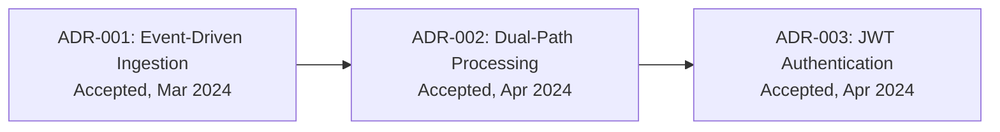

# ADR Template Reference

## What is an ADR?

An Architecture Decision Record (ADR) captures a significant architectural decision along with its context, rationale, and consequences. ADRs provide a decision log that helps current and future team members understand why the system is built the way it is.

## ADR Discovery

The doc-adr skill should look for existing ADRs in these common locations:
- `docs/adr/` or `doc/adr/`
- `docs/architecture/decisions/`
- `adr/`
- `decisions/`
- Any markdown file matching `*ADR*`, `*adr*`, `*decision*`

If no existing ADRs are found, the skill should infer architectural decisions from:
- Technology choices visible in build files (why Spring Boot? why PostgreSQL?)
- Architectural patterns in code (why microservices? why event-driven?)
- Configuration choices (why Redis for caching? why JWT for auth?)
- Comments or README sections mentioning "decision" or "chose" or "decided"

## Markdown Output Format

### ADR Index File: `adr-index.md`

```markdown
---
title: "Architecture Decision Records"
section: "ADRs"
order: 1
generated: "{{DATE}}"
---

# Architecture Decision Records

## Overview
Brief explanation of the ADR process and how decisions are tracked.

## Decision Log

| # | Title | Status | Date | Summary |
|---|-------|--------|------|---------|
| 001 | Use Event-Driven Ingestion | Accepted | 2024-03-15 | Chose SQS + Lambda over synchronous REST for data ingestion |
| 002 | Dual-Path Processing | Accepted | 2024-04-02 | Real-time + batch processing for different data volumes |
| 003 | JWT for API Authentication | Accepted | 2024-04-10 | Stateless auth with short-lived tokens |

## Timeline


```

### Individual ADR File: `adr-NNN.md`

```markdown
---
title: "ADR-NNN: {{TITLE}}"
section: "ADRs"
order: {{N+1}}
generated: "{{DATE}}"
adr_status: "accepted"
adr_date: "{{DECISION_DATE}}"
adr_deciders: "{{TEAM_OR_UNKNOWN}}"
supersedes: ""
superseded_by: ""
---

# ADR-NNN: {{TITLE}}

## Status

**{{STATUS}}** — {{DATE}}

{{If superseded: "Superseded by [ADR-XXX](adr-XXX.md)"}}
{{If supersedes: "Supersedes [ADR-YYY](adr-YYY.md)"}}

## Context

What is the issue that we're seeing that is motivating this decision or change?

Describe:
- The problem or requirement
- The constraints (technical, business, regulatory)
- The forces at play (performance, scalability, team expertise, timeline)

## Decision

What is the change that we're proposing and/or doing?

State the decision clearly and concisely. Include:
- The chosen approach
- Key technology/pattern selected
- Any specific configuration or implementation approach

## Alternatives Considered

### Alternative 1: {{Name}}
- **Description:** What this alternative involves
- **Pros:** Benefits
- **Cons:** Drawbacks
- **Why rejected:** Reason

### Alternative 2: {{Name}}
- **Description:** What this alternative involves
- **Pros:** Benefits
- **Cons:** Drawbacks
- **Why rejected:** Reason

## Consequences

### Positive
- List positive outcomes

### Negative
- List negative outcomes or trade-offs

### Risks
- List risks that need monitoring

## Related

- Links to related ADRs
- Links to relevant code or configuration
- Links to external references
```

## ADR Statuses

| Status | Meaning | Badge Color |
|--------|---------|-------------|
| `proposed` | Under discussion, not yet decided | blue |
| `accepted` | Decision made and in effect | green |
| `deprecated` | No longer relevant (system changed) | yellow |
| `superseded` | Replaced by a newer ADR | orange |
| `rejected` | Considered but not adopted | red |

## Inferring ADRs from Code

When no explicit ADR documents exist, create inferred ADRs for these common decisions:

### Technology Stack
- **Build system choice** (Maven vs Gradle, npm vs yarn)
- **Framework choice** (Spring Boot, Express, Django, etc.)
- **Database choice** (PostgreSQL, MongoDB, DynamoDB, etc.)
- **Cache choice** (Redis, Memcached, in-memory)

### Architecture Patterns
- **Monolith vs Microservices** — infer from deployment configs
- **Sync vs Async communication** — infer from message queue usage
- **REST vs GraphQL vs gRPC** — infer from controller/resolver patterns
- **Event sourcing / CQRS** — infer from event store patterns

### Infrastructure
- **Containerization approach** (Docker, Kubernetes)
- **CI/CD pipeline choice** (GitHub Actions, Jenkins, CircleCI)
- **Cloud provider** (AWS, GCP, Azure) — infer from IaC files

### Mark inferred ADRs clearly:
In the frontmatter, add: `adr_inferred: true`
In the Status section, add: "*This ADR was inferred from code analysis. It may not reflect the original decision-making process.*"
