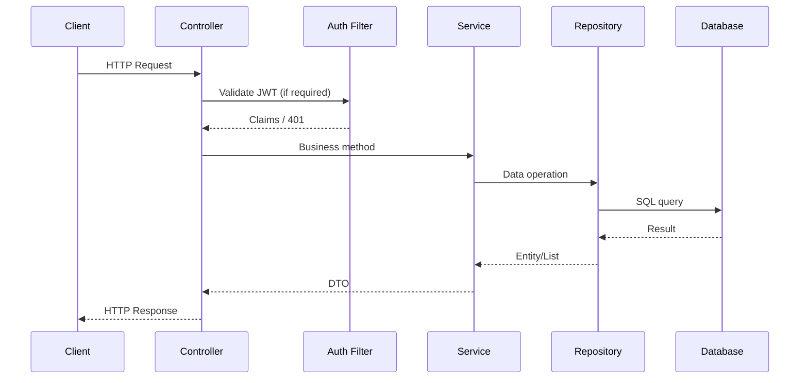
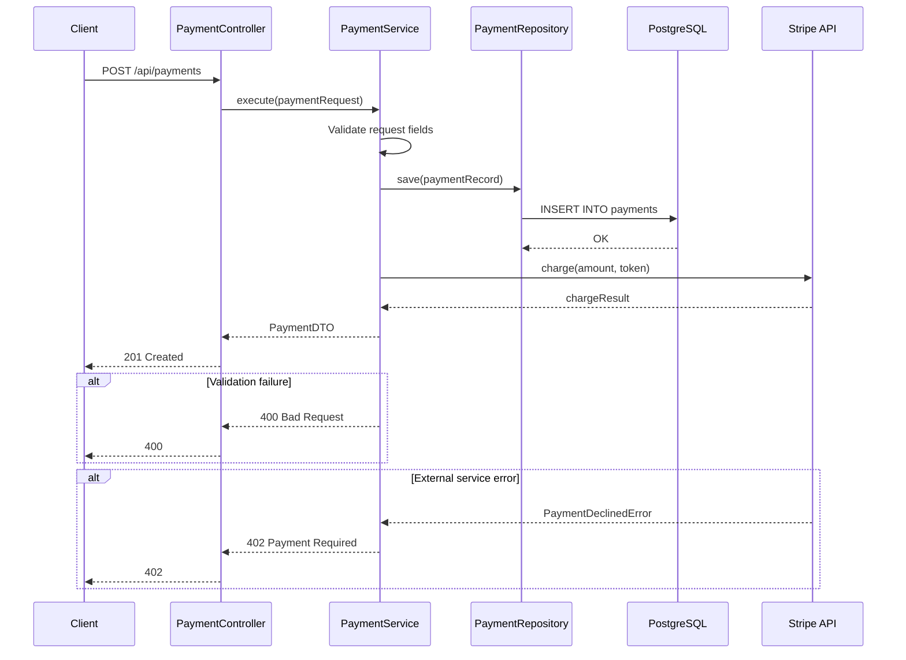

# doc-api

## Description
Generates API documentation: endpoint index, domain-grouped detail pages with Mermaid sequence diagrams for non-trivial endpoints, request/response schemas, and error contracts. Runs as Wave 2.

## Context
fork

## References
- ../references/mermaid-diagram-guide.md

## Instructions

### Inputs
1. Read `docs/.doc-plan.json` — verify `doc-api` is enabled
2. Read `docs/.doc-manifest.json` — get files under `doc-api.files`
3. Read assigned source files in batches of 5-8 to stay within context limits
4. Read prior Wave 1 output for system context (do not regenerate): `docs/md/arch-overview.md`, `docs/md/arch-c4-level1.md`, `docs/md/arch-c4-level2.md`. Use these to reference component names, system boundaries, and container relationships.
5. Read `mermaid-diagram-guide.md` from the shared references directory for Mermaid syntax

### Analysis Steps
1. **Discover endpoints** — scan controllers/routes for HTTP method annotations/calls (e.g. `@GetMapping`, `app.get()`, `@app.route()`, `http.HandleFunc()`). Extract: method, path, params, request/response types.
2. **Trace call chains** — for each endpoint follow controller -> service -> repository/DB -> external APIs -> events. Map the complete chain. Flag endpoints that trigger async side effects after returning a response.
3. **Document request/response** — path params, query params, request body schema (from DTOs/models), response schema, error responses (from exception handlers), auth requirements.
4. **Classify auth level** — for each endpoint, determine the auth level:
   - `JWT` — requires valid JWT token, request fails without it
   - `JWT (optional)` — extracts user context from JWT if present, works without it
   - `Internal` — no JWT, intended for service-to-service calls (typically under `/internal/` or `/event/` paths)
   - `None` — public endpoint, no auth of any kind

### Output Files
All files go to `docs/md/`.

#### `api-index.md` — The API Reference Home

Frontmatter: title "API Endpoint Index", section "API Plane", order 1, generated "{{DATE}}".

Content structure:

**1. API at a Glance** — a preamble before the endpoint tables:
- Total endpoint count
- Base path / context root (e.g., `/vehicle-mgmt`, `/insight-trip`)
- API versioning approach (URL-based, header-based, none)
- Auth model summary: explain the 4 auth levels (JWT, JWT optional, Internal, None) in 1-2 sentences each
- Common patterns:
  - Pagination: how pagination works if the API uses it (offset, cursor, page/pageSize defaults)
  - Error envelope: the standard error response shape
  - Content types: default is `application/json` unless noted otherwise on specific endpoints
  - Async pattern: how async endpoints work (return immediately with acknowledgment, processing continues)

**2. Common Request Flow** — a single `sequenceDiagram` showing the standard CRUD flow that most simple endpoints follow:



Add a note: "Simple CRUD endpoints (get-by-id, delete-by-id, list, catalog lookups) follow this standard pattern. Only endpoints with non-trivial logic have dedicated sequence diagrams on their detail pages."

**3. Endpoint tables** — grouped by resource/domain. Each table has columns:

| Method | Path | Description | Auth | Notes |
|--------|------|-------------|------|-------|

- **Auth** column uses the 4-level classification: `JWT`, `JWT (opt)`, `Internal`, `None`
- **Notes** column for important metadata: `async`, `multipart`, `deprecated`, `paginated`, `idempotent`
- Link each domain group heading to its detail page

**4. Global Error Responses** — a table mapping exceptions to HTTP statuses, showing the standard error contract.

#### `api-{domain}.md` — Domain-Grouped Detail Pages

**Group endpoints by resource/domain**, NOT one file per endpoint. Grouping follows the controller structure:
- One file per controller or per logical domain (e.g., `api-vehicle-management.md`, `api-trips.md`, `api-smartcar.md`)
- Max ~15 endpoints per file. If a domain has more, split into sub-domains.
- File naming: `api-{domain-slug}.md` (e.g., `api-vehicle-services.md`, `api-clumping.md`)

Frontmatter: title "{Domain Name} API", section "API Plane", order N, generated "{{DATE}}".

**Content per endpoint:**

```
## {METHOD} {PATH}

{One-line description of what this endpoint does.}

### Metadata

| Property | Value |
|----------|-------|
| Auth | JWT / JWT (opt) / Internal / None |
| Content-Type | application/json / multipart/form-data |
| Idempotent | Yes / No |
| Async | Yes — returns immediately, processing continues / No |

### Parameters

| Name | In | Type | Required | Description |
|------|-----|------|----------|-------------|
| vehicleId | path | string (UUID) | Yes | Vehicle identifier |
| page | query | number (integer) | No | Page number, default 0 |

### Request Body

{JSON schema with format-annotated types. Only if endpoint accepts a body.}

### Response

**{Status Code}:** {Description}
{JSON schema with format-annotated types}

### Error Responses

| Status | Condition | Body |
|--------|-----------|------|
| 400 | Vehicle not found | `{"error": "Vehicle not found in records"}` |
| 401 | Invalid/missing JWT | `{"error": "Authorization Denied"}` |

### Side Effects

{Only include this section if the endpoint triggers operations beyond the response:}
- Publishes `VehicleAddedEvent` to Redpanda
- Triggers async Experian history fetch (if VIN present)
- Triggers async vehicle price estimation
- Sends push notification to vehicle admins

### Sequence Diagram

{Only for non-trivial endpoints — see diagram rules below}
```

### Schema Type Annotations

Use format-annotated types in all request/response schemas. Never use bare "string" or "number":

| Raw Type | Annotated Type | When to Use |
|----------|---------------|-------------|
| string | `string (UUID)` | IDs, foreign keys |
| string | `string (ISO-8601)` | Timestamps, dates |
| string | `string (enum: VALUE1\|VALUE2\|VALUE3)` | Enum fields — list ALL values |
| string | `string` | Freetext only (names, descriptions) |
| string | `string (max 17 chars)` | Length-constrained fields |
| number | `number (integer)` | Counts, pages, mileage |
| number | `number (decimal)` | Prices, coordinates |
| boolean | `boolean` | Boolean flags |
| object | `object` | Nested objects — show structure |

For enums, ALWAYS list all values inline: `"status": "string (enum: PENDING|CONFIRMED|COMPLETED|CANCELLED|MISSED|DELETED)"`

### Diagram Rules — When to Include Sequence Diagrams

**DO include a sequence diagram** when the endpoint has ANY of:
- **Branching logic** — different paths based on input or state (alt/else blocks)
- **External service calls** — reaches out to another API, message broker, or third-party service
- **Async processing** — returns immediately but triggers background work
- **Caching/rate-limiting** — checks cache before proceeding, enforces rate limits
- **Multi-step orchestration** — >3 meaningful steps beyond the standard CRUD pattern
- **State transitions** — changes entity status with business rules governing the transition
- **Data transformation** — complex mapping, merging, or enrichment before persistence

**DO NOT include a sequence diagram** when:
- The endpoint is simple CRUD: get-by-id, delete-by-id, basic list/filter
- The endpoint is a pure proxy (forwards request to another service unchanged)
- The endpoint is a catalog lookup (years, makes, models, trims, colors, images)
- The flow is identical to the "Common Request Flow" diagram in the index

These trivial endpoints are covered by the single "Common Request Flow" diagram in `api-index.md`.

### Diagram Format — Mermaid Sequence Diagrams

For qualifying endpoints, include a `sequenceDiagram` block showing the full request lifecycle:



**Arrow conventions:**
- `->>` solid arrow: synchronous request (caller waits)
- `-->>` dashed arrow: response / return value
- Use `alt`/`else` for error paths
- Use `opt` for optional flows (e.g., caching, idempotency)
- Use `par` for async/parallel operations that happen after the response
- Use `Note over` for internal processing descriptions

### Data Operations Cross-Reference

Every endpoint that reads or writes data must include a **Data Operations** section linking to the corresponding query and table documentation pages. This creates traceability from API → Query → Table.

Add this section after Side Effects and before Sequence Diagram:

```markdown
### Data Operations

| Operation | Query | Tables | Link |
|---|---|---|---|
| Load user vehicles | findActiveVehiclesByUserId | vehicle, user_vehicle | [view](data--postgres--queries--find-active-vehicles-by-user-id.md) |
| Save new vehicle | save (vehicle) | vehicle | [view](data--postgres--queries--save-vehicle.md) |
| Store image | uploadVehicleImage | S3 bucket | [view](data--s3--operations--upload-vehicle-image.md) |
```

If data pages have not been generated yet (doc-api runs in the same wave as doc-data), use the `--` filename convention to construct the expected link paths. The validation skill will verify these links resolve correctly.

### Rules
- Parameter types must be specific and format-annotated (see type annotation table)
- Response schemas must reflect actual DTO/model fields from the codebase
- Error responses must reflect actual exception handling — list per endpoint, not just globally
- Use real class/method names from the codebase
- Cross-reference related endpoints (e.g., "See also: POST /vehicle/ for creation")
- Cross-reference data operations using the `data--{store}--queries--{name}.md` link convention
- For >20 endpoints, process in batches of ~5 grouped by resource; write index last
- **Source files**: at the end of each page, include a `## Source Files` section listing the controller, service, and DTO/model files with relative paths from the project root

## Tools
- Read
- Glob
- Grep
- Write

## Output
Markdown files in `docs/md/`:
- `api-index.md`
- `api-{domain}.md` (one per resource/domain group)
