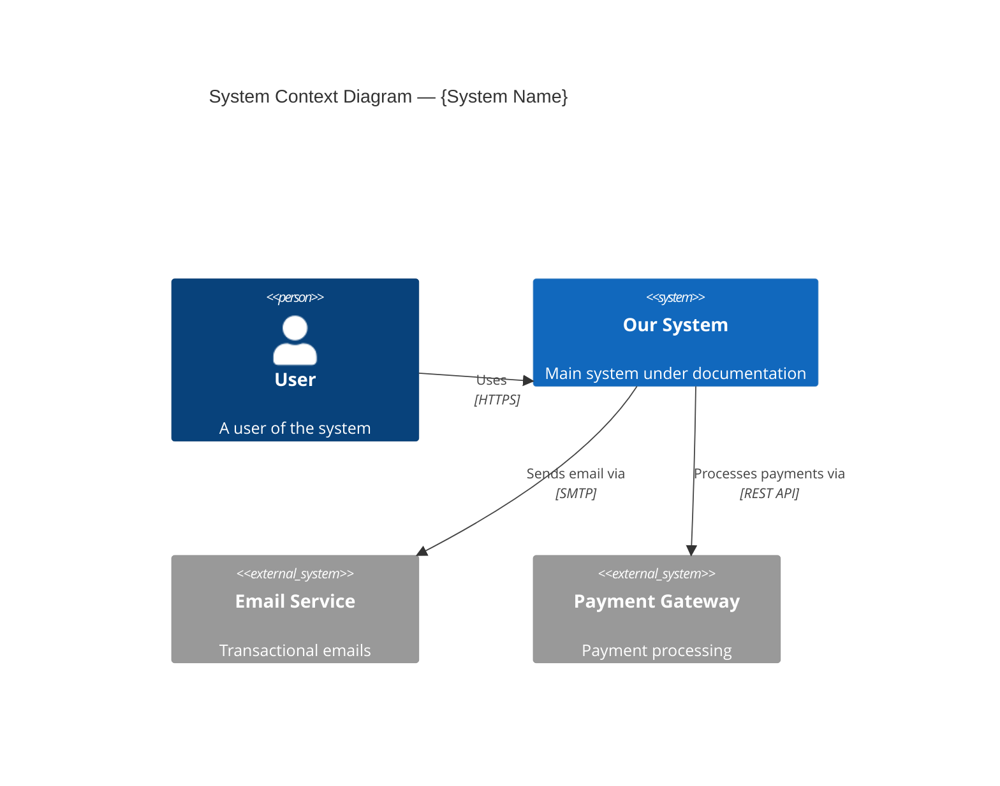
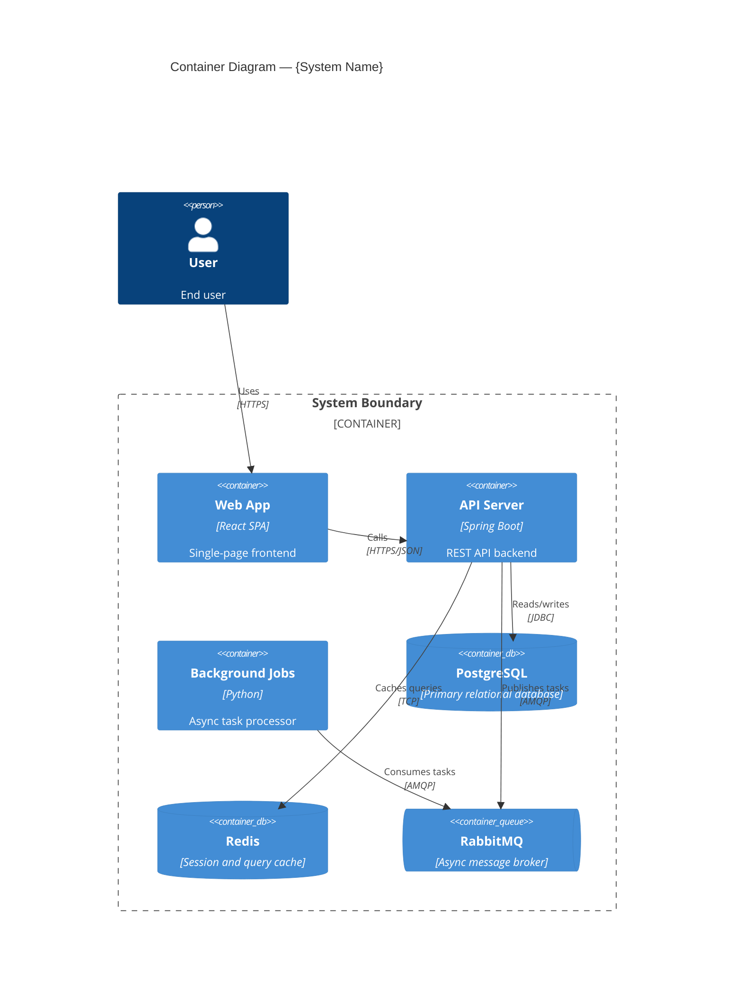
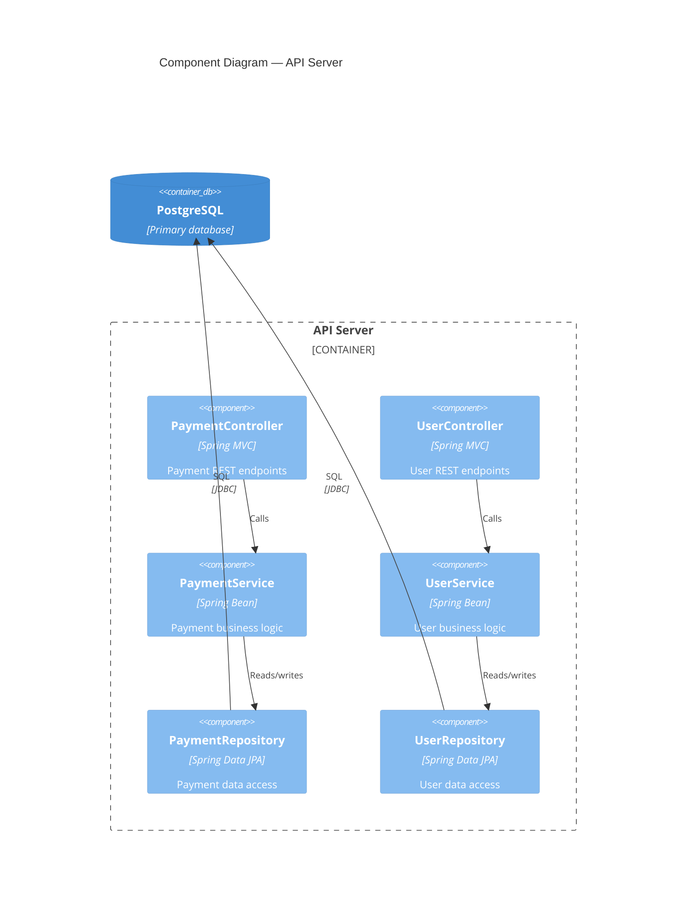
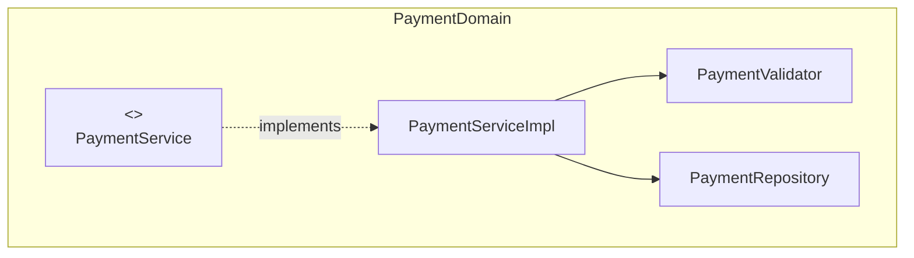
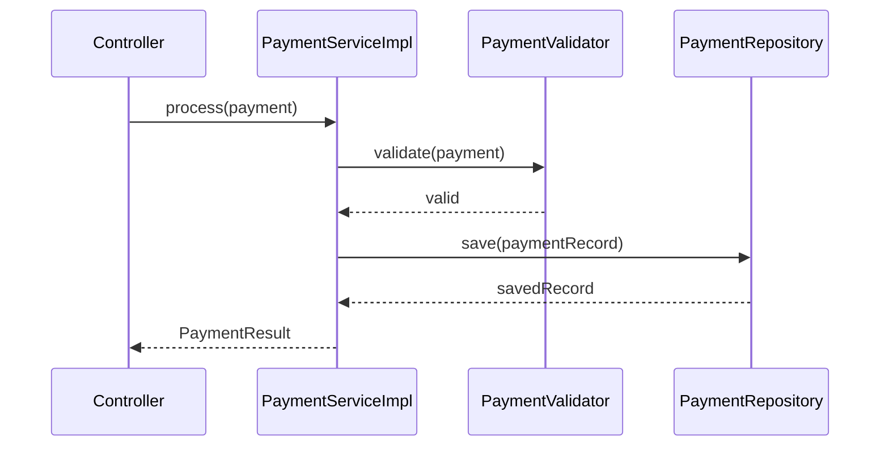

# C4 Model Reference Guide

## Overview

The C4 model provides four levels of abstraction for describing software architecture:
1. **Context** — System context, showing the system and its relationships with users and other systems
2. **Container** — High-level technology choices, showing the containers (applications, data stores) that make up the system
3. **Component** — Component decomposition within each container
4. **Code** — Code-level detail (classes, interfaces) for critical components

## Level 1: System Context

### Purpose
Shows the big picture: who uses the system and what other systems it interacts with.

### What to Include
- The system under documentation (center)
- Users/personas who interact with it
- External systems it depends on or that depend on it
- Labeled relationships (e.g., "sends email via", "reads data from")

### What NOT to Include
- Internal details of the system
- Technology choices
- Protocols or data formats

### Mermaid Format

### Analysis Steps
1. Identify the main system boundary from package structure / deployment configs
2. Scan for HTTP clients, SDK imports, message queue connections to find external systems
3. Check README, docker-compose, environment variables for external dependencies
4. Look for user-facing entry points (controllers, CLI commands, UI components)

## Level 2: Container

### Purpose
Zooms into the system boundary to show the major containers (deployable units).

### What to Include
- Web applications, mobile apps
- API applications / microservices
- Databases (by type: SQL, NoSQL, cache)
- Message queues / event buses
- File storage / blob stores
- Technology labels on each container (e.g., "Spring Boot", "PostgreSQL")
- Communication protocols on arrows (HTTP, gRPC, AMQP, JDBC)

### Mermaid Format

### Analysis Steps
1. Check for multiple deployable units (Dockerfiles, serverless configs, separate package.json files)
2. Identify databases from connection strings, ORM configs, docker-compose services
3. Identify message queues from consumer/producer code, queue configs
4. Map communication patterns from HTTP clients, gRPC stubs, queue bindings

## Level 3: Component

### Purpose
Zooms into a single container to show its internal components.

### What to Include
- Controllers / Route handlers
- Services / Business logic classes
- Repositories / Data access layer
- Event handlers / Message consumers
- External service adapters
- Stereotype labels (Controller, Service, Repository)

### Mermaid Format

### Analysis Steps
1. Scan for controller/route classes → map to component boxes
2. Scan for service classes → map to component boxes
3. Scan for repository/DAO classes → map to component boxes
4. Trace dependency injection to draw arrows between components
5. Group by functional domain (payments, users, etc.)

## Level 4: Code

### Purpose
Shows code-level detail for the most important or complex components. NOT every class — only key abstractions.

### What to Include
- Key interfaces and their implementations
- Important abstract classes
- Core domain model classes with key fields
- Design patterns in use (Strategy, Observer, Factory, etc.)

### Mermaid Format

Use `flowchart TD` for code structure and `sequenceDiagram` for call chains:

### Analysis Steps
1. Identify key interfaces that define system contracts
2. Find implementations and their dependencies
3. Look for design patterns (factory methods, strategy implementations, observers)
4. Focus on domain model, not framework boilerplate

## General Guidelines

### Architecture Overview File
In addition to the C4 level files, produce `arch-overview.md` with:
- System purpose and business context
- Key design principles / architectural style (monolith, microservices, event-driven, etc.)
- Technology stack summary table
- Cross-cutting concerns (logging, monitoring, error handling)
- Links to each C4 level page

### What Makes a Good C4 Diagram
- **Labels on everything** — every box has a name and technology, every arrow has a verb
- **Consistent abstraction level** — don't mix Level 2 and Level 3 detail
- **Left-to-right or top-to-bottom flow** — consistent direction
- **Boundary boxes** — system and container boundaries clearly marked
