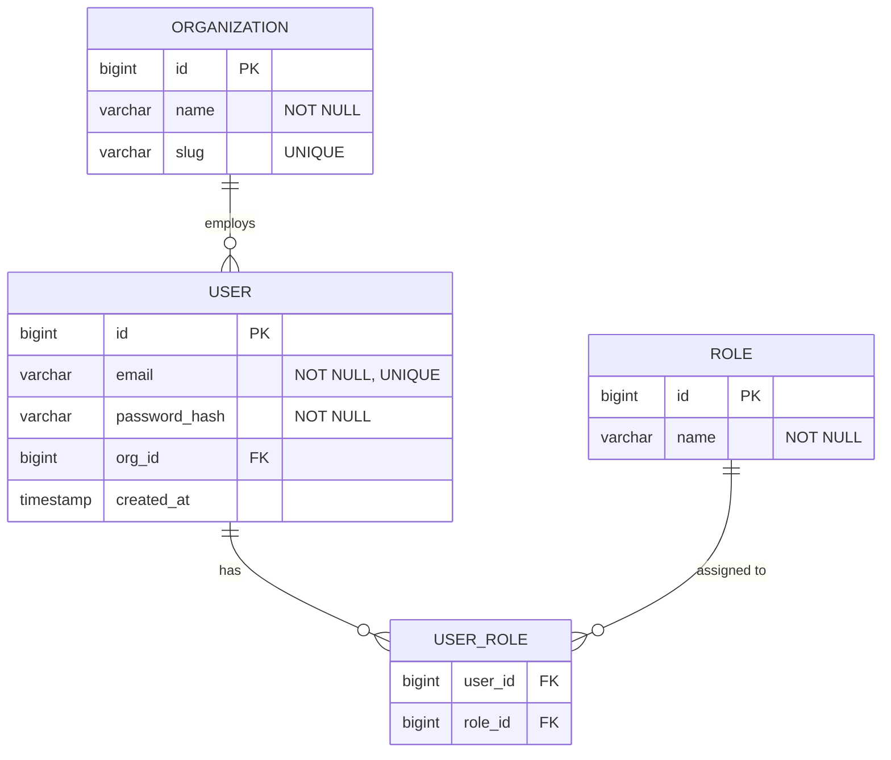
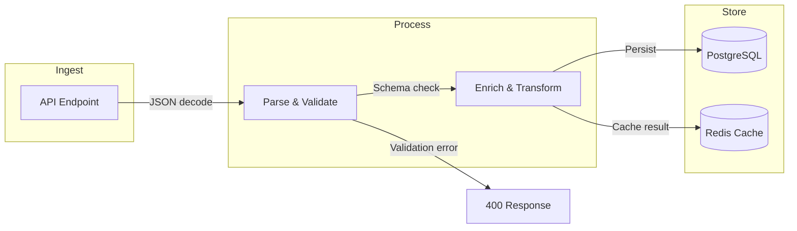

# doc-data

## Description
Runs as Wave 2. Generates data layer documentation: database schemas, entity-relationship diagrams (Mermaid ERD), data pipelines, migration history, and data flow analysis.

## Context
fork

## References
- ../references/mermaid-diagram-guide.md

## Instructions

### Inputs
1. Read `docs/.doc-plan.json` — verify `doc-data` is enabled
2. Read `docs/.doc-manifest.json` — get files under `doc-data.files`
3. Read assigned source files in batches of 5-8 to stay within context limits
4. Read prior Wave 1 output for system context (do not regenerate): `docs/md/arch-overview.md`, `docs/md/arch-c4-level2.md`. Use these to reference container names, database technologies, and system boundaries.
5. Read `mermaid-diagram-guide.md` from the shared references directory for Mermaid syntax

### Analysis Steps
1. **Entity/model discovery** — scan for data model definitions across frameworks (JPA/Hibernate, TypeORM, Sequelize, Django models, Prisma, SQLAlchemy, Go struct tags, ActiveRecord). For each entity extract: table name, columns (name, type, constraints: PK/FK/NOT NULL/UNIQUE/DEFAULT), relationships (type, target, join column/table), indexes.
2. **Schema mapping** — build complete schema: all tables with columns, all FK relationships, join tables for N:M, enum/lookup tables.
3. **Migration analysis** — if migrations exist, read them for schema evolution, major changes, current version.
4. **Data pipeline/flow analysis** — identify ETL jobs, batch processors, import/export handlers, caching strategies (what's cached, invalidation), data validation rules.

### Output Files
All files go to `docs/md/`.

**`data-overview.md`** — Frontmatter: title "Data Layer Overview", section "Data", order 1, generated "{{DATE}}". Content: DB technology and config summary, entity count and relationship summary, data architecture pattern (Active Record, Repository, CQRS, etc.), links to detail pages.

**`data-schema.md`** — Frontmatter: title "Database Schema", section "Data", order 2, generated "{{DATE}}". Content: Mermaid ERD diagram, per-entity documentation (table name, columns with types/constraints, relationships, indexes), migration history summary if available.

**`data-pipelines.md`** — Frontmatter: title "Data Pipelines & Flows", section "Data", order 3, generated "{{DATE}}". Content: Mermaid flowchart data flow diagram, caching strategy, validation rules, import/export processes, batch jobs. If no pipelines exist, document how data enters (API -> entities), how it's read (query patterns, repos), and caching layers.

### Diagram Format — Mermaid

#### ERD Diagrams (data-schema.md)

**Entity format:** Declare each entity with typed fields including constraints (PK, FK, NOT NULL, UNIQUE).
**Relationships:** Use cardinality notation — `||--o{` (one-to-many), `||--||` (one-to-one), `o{--o{` (many-to-many via join table).

#### Data Flow Diagrams (data-pipelines.md)

Use `flowchart LR` for data flows. Stages as nodes, transformations as edge labels, subgraphs for boundaries.

### ERD Splitting Rule

If the schema has **more than 15 entities**, split into domain-focused sub-ERDs:
1. One ERD per functional domain (e.g., "Vehicle Entities", "User & Auth Entities", "Telematics Entities")
2. Each sub-ERD shows full detail for its domain entities and uses simplified references for cross-domain foreign keys
3. A single "full schema" ERD can be included as an overview, but with abbreviated entity definitions (just PK/FK columns) to keep it readable

This prevents large schemas from producing unreadable diagrams.

### Non-Relational Data Stores

If the system uses non-relational stores (DynamoDB, MongoDB, Redis, S3), document them in `data-overview.md` alongside the relational schema:

**DynamoDB/Document stores:**
| Table | Partition Key | Sort Key | GSIs | Purpose |
|-------|-------------|----------|------|---------|

**Redis/Cache stores:**
| Key Pattern | Value Type | TTL | Purpose |
|------------|-----------|-----|---------|

**Object stores (S3, GCS):**
| Bucket/Path Pattern | Content Type | Lifecycle | Purpose |
|--------------------|-------------|-----------|---------|

### Rules
- Every entity in the codebase must appear in the ERD
- All relationships must show cardinality (1:1, 1:N, N:M)
- Column types must be specific (VARCHAR(255), not just "string")
- Foreign keys must be explicitly labeled
- If migrations exist, note current schema version and the range of migration files
- ERDs with >15 entities must be split into domain-focused sub-diagrams
- Non-relational data stores must be documented with their access patterns
- Reference source files (entity classes, migration files) for every table
- **Source files**: at the end of each page, include a `## Source Files` section listing entity classes, repository files, migration files, and data access configuration

## Tools
- Read
- Glob
- Grep
- Write

## Output
Markdown files in `docs/md/`:
- `data-overview.md`
- `data-schema.md`
- `data-pipelines.md`
