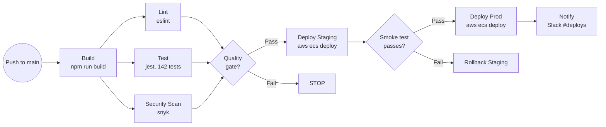
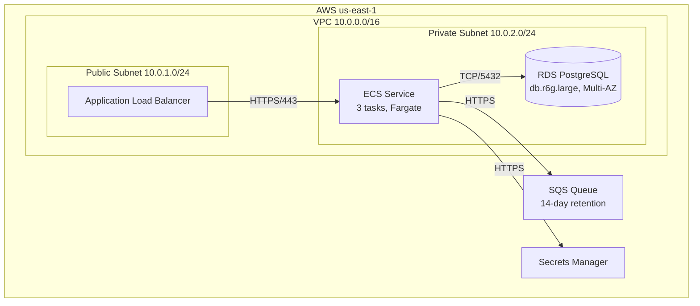

# doc-devops

## Description
Generates DevOps, CI/CD, and infrastructure documentation: build pipelines, deployment architecture, containerization, and infrastructure-as-code analysis. Runs as Wave 3 — cross-cutting analysis that reads Wave 1-2 output for system context. Produces Mermaid diagrams (flowcharts for CI/CD pipelines and infrastructure topology).

## Context
fork

## References
- ../references/mermaid-diagram-guide.md

## Instructions

### Inputs
1. Read `docs/.doc-plan.json` — verify `doc-devops` is enabled
2. Read `docs/.doc-manifest.json` — get files under `doc-devops.files`
3. Read assigned source files in batches of 5-8 to stay within context limits
4. Read prior wave output for cross-domain context (do not regenerate):
   - Wave 1: `docs/md/arch-overview.md` (system overview), `docs/md/arch-c4-level2.md` (container diagram)
   - Wave 2: `docs/md/api-index.md`, `docs/md/data-overview.md`, `docs/md/events-overview.md` (read whichever exist)
   Reference the system architecture to verify deployment model matches the code.
5. Read `mermaid-diagram-guide.md` from the shared references directory for Mermaid syntax

### Analysis Steps
1. **CI/CD pipelines** — analyze GitHub Actions, GitLab CI, Jenkinsfile, CircleCI, AWS CodePipeline configs. Document: stages, triggers, environment targets, test/lint/build/deploy steps, artifact handling, secret/variable management.
2. **Containerization** — analyze Dockerfiles (base images, build stages, ports, healthchecks), docker-compose.yml (services, networks, volumes, dependencies), .dockerignore.
3. **Infrastructure-as-Code** — analyze Terraform (*.tf), AWS CDK, CloudFormation, Kubernetes/Helm manifests, Ansible playbooks. Document: cloud provider, resource topology, networking, scaling policies.
4. **Deployment architecture** — synthesize: deployment topology (what runs where), environment strategy (dev/staging/prod), scaling strategy (auto-scaling, replicas, serverless), networking (VPCs, subnets, LBs, CDN).

### Output Files
All files go to `docs/md/`.

**`devops-overview.md`** — Frontmatter: title "DevOps Overview", section "DevOps", order 1, generated "{{DATE}}". Content: toolchain summary table (tool | purpose | config file), environment overview, deployment strategy summary, links to detail pages.

**`devops-cicd.md`** — Frontmatter: title "CI/CD Pipeline", section "DevOps", order 2, generated "{{DATE}}". Content: CI/CD pipeline Mermaid flowchart, stage-by-stage breakdown, trigger conditions, environment promotion flow, secret management, artifact storage.

**`devops-infra.md`** — Frontmatter: title "Infrastructure", section "DevOps", order 3, generated "{{DATE}}". Content: infrastructure topology Mermaid flowchart, resource inventory table (resource | type | purpose | config), networking overview, scaling config, monitoring/alerting, DR/backup strategy (if visible).

### Diagram Format — Mermaid

#### CI/CD Pipeline Diagrams (devops-cicd.md)

Use `flowchart LR` for pipeline flow. Diamond `{}` for quality gates. Parallel stages fork after build and join at the gate.

#### Infrastructure Topology Diagrams (devops-infra.md)

Use `flowchart TD` with nested `subgraph` for region > VPC > subnet boundaries. Label edges with port/protocol.

### Missing Best Practices Section

Each output file should include a **Missing Best Practices** or **Observations** section identifying gaps compared to industry standards. For each gap:
- State what's missing
- Explain why it matters
- Suggest a specific remediation

Examples: no health check endpoints, no rollback strategy, no canary/blue-green deployment, no auto-scaling rules, no smoke tests after deploy, no secret rotation policy, no monitoring/alerting configuration.

### Rules
- Pipeline diagrams must show actual stages from config files
- Infrastructure diagrams must reflect real resources, not generic cloud diagrams
- NEVER expose secrets, tokens, or credentials — redact them
- Note missing best practices (no health checks, no rolling deployments, etc.) with specific remediation suggestions
- Reference specific config files for every claim
- Environment-specific configurations (memory, capacity, DB endpoints) should be presented in comparison tables across environments
- **Source files**: at the end of each page, include a `## Source Files` section listing the CI/CD configs, Dockerfiles, IaC files, and deployment configs analyzed

## Tools
- Read
- Glob
- Grep
- Write

## Output
Markdown files in `docs/md/`:
- `devops-overview.md`
- `devops-cicd.md`
- `devops-infra.md`
