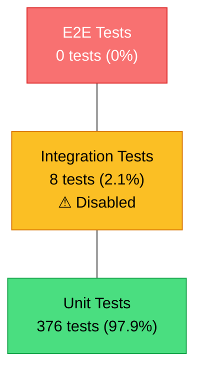
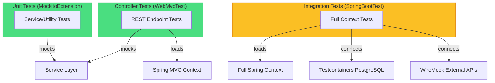

# doc-testing

## Description
Generates testing strategy documentation: test suite inventory with actual counts, coverage gap analysis cross-referenced against API endpoints, testing patterns with code examples, and prioritized recommendations with acceptance criteria. Runs as Wave 3 — reads Wave 1-2 output to assess whether test coverage matches system complexity. Produces a styled Mermaid testing pyramid and a test execution flow diagram.

## Context
fork

## References
- ../references/mermaid-diagram-guide.md

## Instructions

### Inputs
1. Read `docs/.doc-plan.json` — verify `doc-testing` is enabled
2. Read `docs/.doc-manifest.json` — get files under `doc-testing.files`
3. Read assigned source files in batches of 5-8 to stay within context limits
4. Read prior wave output for cross-domain context (do not regenerate):
   - Wave 1: `docs/md/arch-overview.md` (system overview, tech stack), `docs/md/arch-c4-level2.md` (container/component list)
   - Wave 2: `docs/md/api-index.md` (API endpoints for coverage mapping), `docs/md/data-overview.md` (data stores for integration test assessment), `docs/md/events-overview.md` (async flows for test gap analysis) — read whichever exist
5. Read `mermaid-diagram-guide.md` from the shared references directory for Mermaid syntax

### Analysis Steps
1. **Framework discovery** — identify testing frameworks with specific versions: Java (JUnit 4/5, TestNG, Mockito, Spring Test, Cucumber, RestAssured), JS/TS (Jest, Mocha, Vitest, Cypress, Playwright, Testing Library), Python (pytest, unittest, behave, Selenium), Go (testing, testify, gomock), Rust (built-in test, actix-rt, wiremock, testcontainers), Ruby (RSpec, Minitest), C# (xUnit, NUnit, MSTest). Also identify assertion libraries (AssertJ, Hamcrest, chai) and test runners.
2. **Test inventory** — categorize every test: unit (isolated, mocked dependencies), integration (real components: DB/HTTP/queues/containers), E2E (browser/full API contract), contract (Pact, Spring Cloud Contract), performance (JMeter, Gatling, k6). Count per category with percentages. Count per domain/module. Include totals.
3. **Coverage analysis** — find coverage config AND actual coverage metrics if available. Look for: jest.config coverageThreshold, jacoco minimums, .nycrc/.c8rc, pytest coverage plugin, codecov.yml/.coveragerc, cargo-tarpaulin. If coverage reports exist in build output, extract the numbers. If no coverage tooling exists, explicitly state this as a gap.
4. **Testing patterns** — identify: test data builders/fixtures/factories, shared test infra (base classes, testcontainers, helper modules), mocking strategies, DB test strategies (in-memory, testcontainers, fixtures, isolation approach), API test strategies (MockMvc, supertest, httptest, actix-rt test server). For each pattern, note a specific test file as an example.
5. **Endpoint coverage mapping** — cross-reference `api-index.md` endpoint list with test files. For each API endpoint (or endpoint group), determine: is there a test? What kind (unit controller test, integration test, E2E test)? Flag untested endpoints.
6. **CI integration analysis** — determine: which tests run in CI? Are tests gated (build fails on test failure)? Is there parallelization? What's the approximate test execution time? Are any tests disabled/skipped in CI?

### Output Files
All files go to `docs/md/`.

The two files have distinct purposes — **do not duplicate content between them**:
- **testing-overview.md** = Executive dashboard — inventory, metrics, pyramid, coverage gaps. A tech lead reads this to assess testing health in 2 minutes.
- **testing-strategy.md** = Developer guide — how to run tests, how to write new tests, patterns with code examples, mocking approach, recommendations. A new developer reads this to start contributing tests.

#### `testing-overview.md` — Testing Dashboard

Frontmatter: title "Testing Overview", section "Testing", order 1, generated "{{DATE}}".

Content structure:

**1. Testing at a Glance** — a quick summary before the tables:
- Total test count
- Pyramid shape assessment (healthy bottom-heavy / inverted / missing layers)
- Coverage status (percentage if available, or "not configured")
- CI status (tests gated in CI / tests run but not gated / tests not run in CI)
- Critical gaps in 1 sentence (e.g., "No E2E tests; integration tests disabled")

**2. Testing Stack** — table with standardized columns:

| Framework | Version | Category | Purpose | Config File |
|-----------|---------|----------|---------|-------------|
| JUnit 5 | 5.9.3 | Unit/Integration | Test runner | pom.xml |
| Mockito | 5.3.1 | Mocking | Dependency isolation | pom.xml |
| Testcontainers | 1.18.3 | Integration | PostgreSQL container | BaseIntegrationTest.java |

Always include: Framework, Version, Category (unit/integration/mocking/assertion/container), Purpose, Config File.

**3. Test Inventory** — two tables:

**By Category** (unit, integration, E2E, contract, performance):

| Category | Count | Percentage | Status |
|----------|-------|------------|--------|
| Unit | 192 | 50.0% | Active |
| Integration | 8 | 2.1% | Disabled — missing Testcontainers config |
| E2E | 0 | 0% | Not implemented |
| **Total** | **384** | **100%** | |

Always include: Count, Percentage, Status (Active / Disabled with reason / Not implemented). Always include a **Total** row.

**By Domain/Module:**

| Domain | Test Count | Percentage | Primary Pattern |
|--------|-----------|------------|-----------------|
| Vehicle Management | 45 | 11.7% | @WebMvcTest |
| Service Records | 38 | 9.9% | @SpringBootTest |
| **Total** | **384** | **100%** | |

Always include a **Total** row and a **Primary Pattern** column showing the dominant test annotation/style.

**4. Testing Pyramid** — Mermaid `flowchart TD` with color-coded styling:



**Styling rules:**
- Green (`#4ade80`): Layer has adequate coverage (>20% of total, or appropriate for the layer)
- Yellow (`#fbbf24`): Layer exists but is thin, disabled, or has gaps
- Red (`#f87171`): Layer is missing entirely (0 tests)

Below the diagram, add a 2-3 sentence **Pyramid Assessment** explaining the shape: Is this healthy? What does the distribution tell us about the testing strategy? If inverted, why might that be (e.g., Rust's type system reduces need for unit tests, or the team chose integration-first)?

**5. Endpoint Coverage Map** — cross-reference with `api-index.md`:

| Endpoint Group | Endpoints | Tested | Untested | Coverage |
|---------------|-----------|--------|----------|----------|
| Vehicle CRUD | 6 | 5 | 1 (DELETE /vehicle/{id}) | 83% |
| Smartcar Integration | 4 | 2 | 2 | 50% |
| Telematics | 3 | 0 | 3 | 0% |
| **Total** | **23** | **15** | **8** | **65%** |

Group by the same domain groupings used in `api-index.md`. Flag any endpoint group with 0% coverage in bold/red. This section is the key value-add of Wave 3 context — **only possible because the API agent ran first**.

If `api-index.md` does not exist (API agent was not enabled), skip this section with a note.

**6. Coverage Metrics** — report actual numbers, not just tool configuration:

| Metric | Value | Threshold | Status |
|--------|-------|-----------|--------|
| Line coverage | 72.3% | 80% (JaCoCo) | Below threshold |
| Branch coverage | 58.1% | None configured | — |
| Instruction coverage | 68.9% | None configured | — |

If coverage tooling exists but numbers are not in a parseable report, note "Coverage tooling configured but metrics not available in static analysis." If no coverage tooling exists at all, state: "**No coverage tooling configured.** This is a critical gap — there is no way to measure or enforce test quality."

**7. Links** — to testing-strategy.md and relevant prior wave docs.

#### `testing-strategy.md` — Developer Testing Guide

Frontmatter: title "Testing Strategy", section "Testing", order 2, generated "{{DATE}}".

Content structure:

**1. How to Run Tests** — the first thing a new developer needs:

```
## How to Run Tests

### Prerequisites
- Docker (required for Testcontainers)
- JDK 17+

### Commands

| Command | What It Runs | Approximate Time |
|---------|-------------|-----------------|
| `mvn test` | All unit tests | ~45s |
| `mvn verify` | Unit + integration tests | ~3m (requires Docker) |
| `mvn test -pl module-name` | Tests for a specific module | Varies |

### Environment Variables
| Variable | Required For | Default |
|----------|-------------|---------|
| `DATABASE_URL` | Integration tests | Testcontainers auto-provisions |
```

Adapt commands to the actual build tool (mvn, gradle, cargo test, npm test, pytest, go test). Include approximate execution times if inferable from test count and type (integration tests are typically 1-5s each, unit tests <100ms each).

**2. Test Organization** — directory structure and naming conventions:
- Show the actual test directory tree (abbreviated)
- Document the naming convention with 2-3 real examples
- Note any naming convention enforcement (linting, custom rules)

**3. Testing Patterns** — for each distinct testing pattern found, document:
- Pattern name and when to use it
- 1 code example (5-15 lines) from the actual codebase with file path reference
- What context/infrastructure it requires (Spring context? Docker? External service?)
- Limitations or gotchas

Organize patterns by test type:
- **Unit test patterns** (isolated, mocked)
- **Integration test patterns** (real DB, real HTTP, containers)
- **API/controller test patterns** (MockMvc, test servers)
- **Error/failure test patterns** — how are error responses, timeouts, and external service failures tested? Show at least one example of a negative test case.

**4. Test Infrastructure** — shared test utilities:
- Base test classes and what they provide (list mock/bean setup)
- Test data builders/factories and how to use them
- Helper functions (mock setup, assertion helpers)
- Container lifecycle (Testcontainers setup, cleanup strategy)

If a base test class has an excessive number of mocked dependencies (>10), note this as a potential concern — it may indicate tight coupling in the production code.

**5. Mocking Strategy** — organized by what's being mocked:
- External HTTP services (how? WireMock, MockServer, inline mocks)
- Database (real DB in container, in-memory, mocked repository)
- Message brokers (embedded broker, mocked producer/consumer)
- Cache (real Redis in container, in-memory mock)

**6. Test Isolation & Parallelism** — critical for integration-heavy suites:
- How are tests isolated from each other? (Transaction rollback, separate DBs, randomized table names, Docker container per test)
- Can tests run in parallel? What prevents it? (Shared state, port conflicts, singleton Spring context)
- How is test data cleaned up?

**7. CI Integration** — pipeline details (only in this file, NOT duplicated in overview):
- Which tests run in CI (and which don't, with reason)
- Pipeline stage configuration (if available, show the relevant YAML/config snippet)
- Test failure gating (does build fail on test failure?)
- Test result reporting (where do results appear — Surefire XML, JUnit XML, etc.)
- Parallelization configuration

**8. Test Execution Flow** — Mermaid `flowchart TD` showing how different test types relate to the system under test:



This diagram shows readers which test type loads which context and connects to which infrastructure.

**9. Recommendations** — prioritized with acceptance criteria:

Format each recommendation as:

```
### Priority 1 (Critical)

#### Add Integration Test Coverage for Untested Endpoints

**Current state:** 8 of 23 API endpoints have no test coverage (see Endpoint Coverage Map in testing-overview.md).

**Recommendation:** Add at least one integration test per untested endpoint, focusing on the happy path and the primary error path.

**Acceptance criteria:**
- All endpoints in the API index have at least one test
- Endpoint coverage reaches ≥90%
- Tests run in CI and are gated (build fails on test failure)

**Relevant files:** VehicleController.java, SmartcarController.java
```

Priority tiers:
- **Critical**: Gaps that could allow production bugs (no CI test execution, disabled tests, untested critical paths)
- **High**: Gaps that reduce confidence (missing error path tests, no coverage thresholds, inverted pyramid)
- **Medium**: Improvements to developer experience (test execution time, parallel execution, better test data management)
- **Low**: Polish (naming convention enforcement, assertion library consistency, documentation)

Each recommendation MUST have: Current state, Recommendation, Acceptance criteria, Relevant files.

**10. Source Files** — list the key test infrastructure files analyzed.

### Diagram Format — Mermaid

#### Testing Pyramid (`testing-overview.md`)

Use `flowchart TD` with color-coded styling. Always include:
- Exact counts and percentages in node labels
- Status annotations (e.g., "⚠ Disabled", "✗ Missing")
- Color coding: green (healthy), yellow (thin/disabled), red (missing)
- Contract/performance tests as separate nodes connected with dotted lines if they exist

#### Test Execution Flow (`testing-strategy.md`)

Use `flowchart TD` with subgraphs per test type. Show:
- What context each test type loads
- What infrastructure each type connects to
- Styled by health (green = active, yellow = limited, red = disabled)

### Rules
- Test counts must be from actual file/method scanning, not estimates
- Framework versions must be specific (JUnit 5.9.3, not just "JUnit")
- Reference specific test files as examples of each pattern
- Note significant gaps explicitly (e.g., "No E2E tests", "Integration tests disabled")
- Coverage metrics must come from actual reports or config, not assumptions
- **No content duplication between overview and strategy** — each fact lives in exactly one file
- CI details live in strategy only; overview gets a one-line status
- Coverage config details live in overview only; strategy references it
- Table formats must be standardized: always include percentages, always include totals, use consistent column names
- **Source files**: at the end of each page, include a `## Source Files` section listing the key test files and configs analyzed

## Tools
- Read
- Glob
- Grep
- Write

## Output
Markdown files in `docs/md/`:
- `testing-overview.md`
- `testing-strategy.md`
